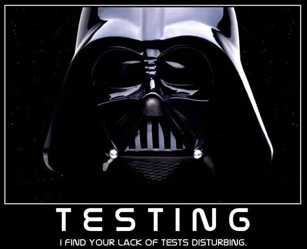
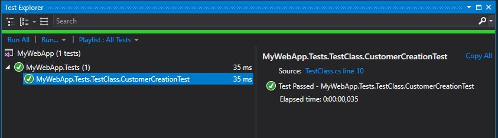

In this series of tutorials I'll try to guide you through the path of Unit Testing. At the end, hopefully, we'll be able to set up one or more testing projects using xUnit.Net in order to have a good code coverage of your application.

## xUnit.Net ([Official Website](https://xunit.github.io/))

xUnit.net is a free, open source, community-focused unit testing tool for the .NET Framework. Written by the original inventor of NUnit v2, xUnit.net is the latest technology for unit testing C#, F#, VB.NET and other .NET languages. xUnit.net works with ReSharper, CodeRush, TestDriven.NET and Xamarin. It is part of the [.NET Foundation](https://www.dotnetfoundation.org/), and operates under their [code of conduct](https://www.dotnetfoundation.org/code-of-conduct). It is licensed under [Apache 2](https://opensource.org/licenses/Apache-2.0) (an OSI approved license).

Unit testing is usually a very mistreated and underestimated topic especially from business managers and also from some developers. Planning, developing and maintaining a good set of tests is something that takes a substantial effort, especially at the beginning of a project. But it also reduces the possibilities of unexpected events after a deploy and saves you a HUGE amount of time when debugging.



There are many types of tests and techniques out there. In this section we'll focus on **Unit Tests** using xUnit.

Unit testing refers to tests that verify the functionality of a specific section of code, usually at the function level. In an object-oriented environment, this is usually at the class level, and the minimal unit tests include the constructors and destructors.[Wikipedia](https://en.wikipedia.org/wiki/Software_testing#Unit_testing)

All right, supposing you already have your application solution open in Visual Studio, all you need to do is to create a new "Class Library" project and install the xunit package. To install xUnit, simply right click on the testing project and "Manage Nuget Packages". From the new window, search for xUnit and install the latest version. Now just add your main project as a reference to the testing project (in order to access and tests all the public classes) and create all the tests you need dividing them in proper classes and namespaces.

Perfect, now some example!

This is the class in our main project that we want to test:

```csharp
using System;

namespace MyWebApp.Web.Models
{
    public class Customer
    {
        public Customer()
        {
            Id = Guid.NewGuid().ToString();
        }

        public string Id { get; set; }
        public string Name { get; set; }
    }
}
```

And this is the related test class in our testing project:

```csharp
using System.Collections.Generic;
using MyWebApp.Web.Models;
using Xunit;

namespace MyWebApp.Tests
{
    public class TestClass
    {
        [Fact]
        public void CustomerCreationTest()
        {
            var customer = new Customer();
            Assert.NotNull(customer.Id);
        }
    }
}
```

As said before, in unit tests we verify the functionality of a specific section of code or functionality. In this case we want to make sure that whenever we create a new customer, its id is not null. Generally you want a class to cover a unique section and each method should test one single functionality. Remember: the more tests, the better. I'll explain a bit in deep what's going on.

`[Fact]` => This is the most common attribute for a xUnit test. With this you basically tell xUnit: " _Hello, this is a test. Take it into account please._" Facts are tests which are always true no matter what. They test invariant conditions.

`Assert.NotNull(customer.Id);` => Assertions are the core of a test. A test can have one or many Asserts. With this class you can "prove" almost any kind of thing. If the assertion you're stating is not valid then it will throw a special xUnit Exception. Other examples of Asserts are:  `Assert.True(2 == 2);` , `Assert.Empty(new List<string>());` and `Assert.Equal("ciao", "ciao");`.

Once you've written your first test, you need to run it and check the result. If you have [Resharper installed](https://www.jetbrains.com/resharper/), all you need to do is to open its own Unit Test Explorer: Open Resharper menù => Unit Tests => Unit Tests. If you don't have Resharper and want to use the Visual Studio integrated Test Explorer, you need to install the xUnit "runner". To do this just go to the nuget package manager and search for "xunit.runner.visualstudio" and install it (as you did previously for the xUnit nuget).

Now, rebuild your testing project and open the visual studio test explorer: Go to the toolbar => Tests => Windows => Test Explorer. It's essential that you rebuild your project, otherwise you won't see any test in the Test Explorer.

Once you've chosen your favorite Test Explorer, you should see a list of tests inside (only 1 for the moment). Select your test (CustomerCreationTest), right click and "Run Selected Tests". If you did everything as I said, the test should pass.



Of course this is just the very basic test you can achive with xUnit. There are many other possibilities with this package (like passing various sets of parameters and run the test for each of them). In the next chapters we'll see how to setup more complex tests....
