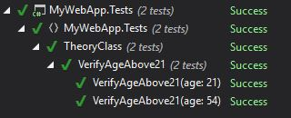

In the last article we introduced xUnit.net and talked about the very basic way to write tests with the `[Fact]` attribute. Today will we'll add some spicy to our tests with the `[Theory]` attribute.

The `[Theory]` attribute allows you to dynamically pass a set of data to your test method and to execute a test for every given set. This way you can reduce duplicated code and cover as much edge cases as you want without increasing unwanted "noise" inside your class.

Ok now, let's take our old **Customer** class and imagine that our service is available only to people with age > 21. So we create a method that checks the age of the customer and we'll write a bunch of tests for it.

## New Customer class

We add the age property inside the customer class.

```csharp
public class Customer
{
    public Customer()
    {
        Id = Guid.NewGuid().ToString();
    }

    public string Id { get; set; }
    public string Name { get; set; }
    public int Age { get; set; }
}
```

## Customer manager class

This class will contain our support method to verify the customer age. It'll return true only if the customer age is equal or greater than 21.

```
public class CustomerManager
{
    public bool IsCustomer21(Customer customer)
    {
        return customer.Age >= 21;
    }
}
```

## Test class

```csharp
[Theory]
[InlineData(21)]
[InlineData(54)]
public void VerifyAgeAbove21(int age)
{
    var customer = new Customer
    {
        Name = "Customer1",
        Age = age
    };
    var mgr = new CustomerManager();

    Assert.True(mgr.IsCustomer21(customer));
}
```

Our test method will setup the customer with the given age, create a `CustomerManager` and Assert that the `IsCustomer21` method returns `true` (which means that the customer is above the legal age).

To do this we use the `[Theory]` attribute and an `[InlineData()]` attribute for each parameter we want to test (so 21 and 54 in this case). To make it compile we only need to provide our test method an input parameter that matches the passed set of data type. When we run it we'll se this result:



As you can see, this test was actually a set of 2 tests: one with `age == 21` and another with `age == 54`. And they all passed.

In the next article we'll see that there are, at least, 2 other ways of passing a set of data to a test method using the `[Theory]` attribute: the `[ClassData]` and `[MemberData]`. They both extend the base xUnit `[DataAttribute]` and allow you to pass more complex data to your test methods.
