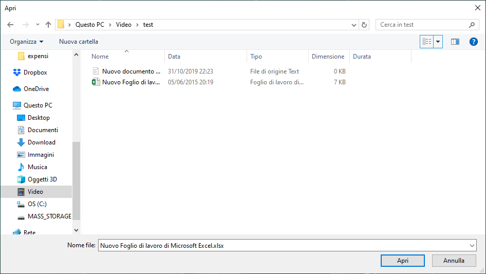
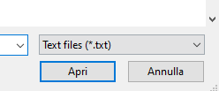

WPF (Windows Presentation Foundation) is a set of libraries relying on the .NET Framework (also available from .NET Core 3) which allows you to build graphical desktop applications. On December 2018,  [Microsoft](https://en.wikipedia.org/wiki/Microsoft) announced releasing WPF as open source project on [GitHub](https://github.com/dotnet/wpf).

## File Dialog

When building desktop applications, you'll likely find yourself in the need of asking the user to pick a file or a directory, and the easiest way to accomplish this task is by using the typical dialog windows:

<figure>



<figcaption>

Example of file dialog window

</figcaption>

</figure>

In this case the Microsoft.Win32.OpenFileDialog class is our best friend. In order to show up, this window only needs a few lines of code which are usually placed inside a button's OnClick method:

```csharp
private void ButtonBase_OnClick(object sender, RoutedEventArgs e)
{
    var openFileDialog = new OpenFileDialog();
    if (openFileDialog.ShowDialog() == true)
    {
        // do something with the filename
        MessageBox.Show(openFileDialog.FileName);
    }
}
```

You can also specify a filter, which will show only certain type of files, like this:

```csharp
var openFileDialog = new OpenFileDialog
{
    Filter = "Text files (*.txt)|*.txt|All files (*.*)|*.*",
};
```

<figure>



<figcaption>

Filter shown in a file dialog window

</figcaption>

</figure>

## Folder Dialog

Another typical case is when you need the user to select a folder. This time a File Dialog won't do the job and you'll need something different. If you've ever used WinForms you'd probably know FolderBrowserDialog class. Unfortunately this is not available in WPF by default, but don't worry, you can still solve this in at least 3 different ways:

1. Add the System.Windows.Forms DLL and use the FolderBrowserDialog class
2. Install the [Ookii.Dialogs nuget](https://www.nuget.org/packages/Ookii.Dialogs/) and use the VistaFolderBrowserDialog class
3. Install the [Windows API Code Pack-Shell](https://www.nuget.org/packages/Microsoft.WindowsAPICodePack-Shell) and use the CommonOpenFileDialog class

The one I use the most is the Ookii.Dialogs one which looks easier and simpler to me. Just use this snippet and you're ready to go:

```csharp
private void ButtonBase2_OnClick(object sender, RoutedEventArgs e)
{
    var ookiiDialog = new VistaFolderBrowserDialog();
    if (ookiiDialog.ShowDialog() == true)
    {
        // do something with the folder path
        MessageBox.Show(ookiiDialog.SelectedPath);
    }
}
```

Until now, those methods only work when targeting the .NET Framework. I still haven't found a good way to prompt a folder dialog on .NET Core while maintaining the application cross-platform. Feel free to leave a comment below if you have any suggestion.
