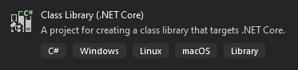

In this article I'll quickly show you an easy way to test a web application, written in any language you like, using .NET Core and Selenium. With "testing the application" I mean to simulate an interaction with the website just like a human user would do. This way it is possible to automatically replicate almost any kind of user interaction with your web application.

[Selenium](https://www.selenium.dev/) is a portable and open-source framework for testing web applications, which allows users to build simple or complex interactions with most of the websites using a wide range of programming languages such as C#, Groovy, Java, Perl, PHP, Python, Ruby, and Scala.


In this case, we will use the Selenium WebDriver, one of the components of the Selenium Suite, which is the core of the whole automation procedure and provides a collection of language-specific bindings to drive a browser the way you want. We'll also need a specific browser driver based on the browser we want to use (i.e. Chrome, Edge, etc.). But I'll explain this step-by-step in while. In simple words, you can test your web application by writing simple scripts and then run them over and over again.

For this article, we will use Selenium in combination with one of my favorite unit testing frameworks, [xUnit](https://xunit.net/), and we will wrap everything in a .NET Core application. Make sure to have a stable [.NET Core SDK](https://dotnet.microsoft.com/download/dotnet-core/thank-you/sdk-3.1.201-windows-x64-installer) version installed on your system (in this article we'll use the v3.1). To build the project I highly suggest using [Visual Studio or Visual Studio Code](https://visualstudio.microsoft.com/) as code editors.

## Setup the project

Open Visual Studio and create a new Solution together with a new .NET Core Class Library:



Delete any eventual .cs file and **install the following nugets**:

- [xUnit](https://www.nuget.org/packages/xunit/): `PM> Install-Package xunit -Version 2.4.1`
- [Selenium WebDriver](https://www.nuget.org/packages/Selenium.WebDriver): `PM> Install-Package Selenium.WebDriver -Version 3.141.0`
- [Selenium Chrome Driver](https://www.nuget.org/packages/Selenium.WebDriver.ChromeDriver/): `PM> Install-Package Selenium.WebDriver.ChromeDriver -Version 81.0.4044.6900`
- [A relative Chrome browser installation](https://www.google.com/intl/en_us/chrome/) (version 81 in this case)

## First tests

Now we're ready to create our first Class file that will hold our selenium tests. A very first simple test can be to open a new browser window, navigate to the google home page and close it.

## Simply open a browser and navigate a specific URL

```csharp
public class SimpleTests
{
    [Fact]
    public void NavigatePage()
    {
        var driver = new ChromeDriver();
        driver.Url = "https://www.google.com";
        Thread.Sleep(3000);
        driver.Dispose();
    }
}
```

`[Fact]` - it is an xUnit attribute to identify a test

`var driver = new ChromeDriver();` - here we instantiate a new browser window

`driver.Url = "https://www.google.com";` - here we instruct the browser to navigate to a specific URL

`driver.Dispose();` - finally, we dispose the browser window. It's very important to dispose it otherwise you'll end up with dozen of browser windows hanging around open.

`Thread.Sleep(3000);` - this is used to not let the browser close immediately

## Fill text fields and click buttons

In this example we open a browser window, navigate to the google home page, fill the word "italy" inside the search field and hit the search button:

```csharp
[Fact]
public void SearchWithGoogle()
{
    var driver = new ChromeDriver();
    driver.Url = "https://www.google.com";
    Thread.Sleep(1000);

    var textField = driver.FindElementByName("q");
    textField.SendKeys("italy");

    var searchButton = driver.FindElementByName("btnK");
    searchButton.Click();

    Thread.Sleep(3000);
    driver.Dispose();
}
```

In addition to the first example here we have:

`var textField = driver.FindElementByName("q");` - one of the many ways to search for an html element inside the page.

`textField.SendKeys("italy");` - this is how we can "type" something inside a text field.

`searchButton.Click();` - and this is how we "click" a button inside the page.

## Take actions and assert the result

In this example, we'll navigate to the Discord status page, look for the main system status banner, read the text and assert that it's displaying "All Systems Operational". Be aware, this example could be not valid anymore in case Dicords decides to change the page content or layout.

<figure>


<figcaption>

The html element we're looking for

</figcaption>

</figure>

```csharp
[Fact]
public void NavigateToStatusPage_AssertStatusIsOk()
{
    var driver = new ChromeDriver();
    driver.Url = "https://status.discordapp.com/";

    try
    {
        var statusField = driver.FindElementByCssSelector("span.status");
        Assert.NotNull(statusField.Text);
        Assert.Equal("all systems operational", statusField.Text.ToLower());
    }
    finally
    {
        Thread.Sleep(1000);
        driver.Dispose();
    }
}
```

`var statusField = driver.FindElementByCssSelector("span.status");` - here we look for the element using a CSS selector, so we want to find the first <span> element with 'status' as a class.

`Assert.NotNull(statusField.Text);` - we make sure the text gathered from the html element is not null

`Assert.Equal("all systems operational", statusField.Text.ToLower());` - and here we compare the element text to make sure the systems are operational.

In this example, there's a higher chance for the test to fail and that's why I wrapped the code in a try/finally. If any exception is thrown, the `finally` will make sure to dispose the browser and the test will fail correctly.

## Conclusions

We can conclude here this quick introduction on how to automate testing using Selenium and .NET Core. Tests are usually way more complex than these. For example, a standard authentication web platform could have thousands of tests, to cover the most important functionalities such as registration, authentication, forgot password, etc. It could also take hours to run the complete suite, especially if you want to test many types of devices. That's why companies sometimes dedicate entire machines only for running those kinds of tests and to do, they can decide whether to host themselves a [Selenium Grid](https://www.selenium.dev/documentation/en/grid/) or rely on a cloud testing platform like [SauceLabs](https://saucelabs.com/).
