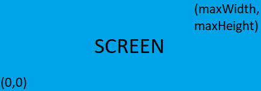
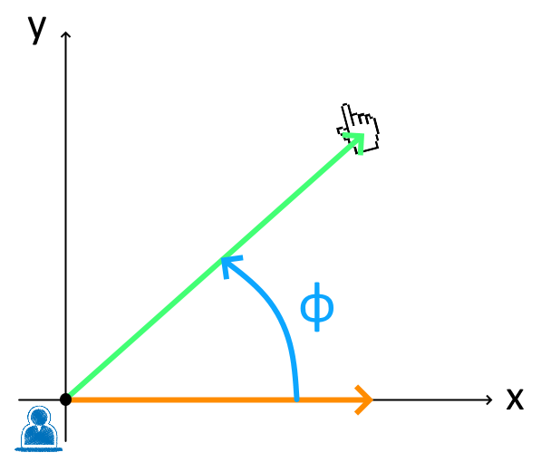

import Latex from "@/components/Latex.astro";

---

In this article I'll briefly explain how you can rotate an object, using Unity, in order for it to "look" at the mouse position.

## TL;DR

Here's the code snippet which will make the `player` transform point towards the mouse position. Please read below if you're interested in how this works.

```csharp
private void PointToMouse(Transform player)
{
    var mouseScreenPos = Input.mousePosition;
    var startingScreenPos = mainCamera.WorldToScreenPoint(player.position);
    mouseScreenPos.x -= startingScreenPos.x;
    mouseScreenPos.y -= startingScreenPos.y;
    var angle = Mathf.Atan2(mouseScreenPos.y, mouseScreenPos.x) * Mathf.Rad2Deg;
    player.rotation = Quaternion.Euler(new Vector3(0, 0, angle));
}
```

## Explanation

Let's start with the definition [Math.Atan2](https://docs.unity3d.com/ScriptReference/Mathf.Atan2.html) that you can find in the Unity documentation:

> Returns the angle in radians whose Tan is y/x.
> Return value is the angle between the x-axis and a 2D vector starting at zero and terminating at (x,y).

And that's why, at line 7, we provide the x and y of the mouse position (multiplying everything by the radians-to-degrees conversion constant). But where does all this come from?

To understand that, we need to dust off some old mathematics memories and make use of some linear equation formulas. And so, given two lines:

<Latex formula='y_1 = m_1x_1 + q_1 \\ y_2 = m_2x_2 + q_2'/>

and their respective slopes `m1` and `m2`, the angle between them is given by:

<Latex formula='\varphi = \arctan \left| \dfrac{m_1 + m_2}{1 + (m_1 m_2)} \right|'/>

All right but, how do we go from the formula above to the Unity's one which basically is:

<Latex formula='\tan (\varphi) = \left|\dfrac{y_2}{x_2}\right| \Rightarrow \varphi = \arctan \left|\dfrac{y_2}{x_2} \right|'/>

Simply by considering the first line as the x-axis, and the second one (the one pointing to the mouse) as passing from zero. That gives us the following:

<Latex formula='\begin{aligned}y_1 &= m_1x_1 = 0 \Rightarrow m_1 = 0 \\ y_2 &= m_2x_2 \Rightarrow m_2 = \dfrac{y_2}{x_2}\end{aligned}'/>

And by replacing slopes with their respective values, we end up with:

<Latex formula='\varphi = \arctan \left|\dfrac{0 + \dfrac{y_2}{x_2}}{1 + (0\dfrac{y_2}{x_2})} \right| \Rightarrow \varphi = \arctan \left|\dfrac{y_2}{x_2} \right|'/>

## Applying the simplified formula in Unity

In order to use this simplified version in Unity, we need to apply some tweaks. The easiest way to accomplish this is to move from the world-space (measured in units) to the screen-space (measured in pixels). The screen-space comes very handily in this case because it emulates the "first quadrant" of a "Cartesian plane", where all the x and y are positive. [Find more info here](https://en.wikipedia.org/wiki/Cartesian_coordinate_system#Two_dimensions).

<figure>



<figcaption>

Unity's screen representation

</figcaption>

</figure>

In order to work on the screen-space, we fetch the mouse position using `Input.mousePosition` (line 3), and then we have to transform the player position from world to screen coordinates with `mainCamera.WorldToScreenPoint(player.position)` (line 4). After that, we just need to translate the points (lines 5/6) in order to have the player in (0,0) (remember that Unity's formula implies the first line to be the x-axis).

Once done, we should end up in a situation like this, and therefore being able to apply our simple formula to retrieve the correct angle and then apply a rotation to the player's transform (line 8):



## Wrapping up

Unity is a very well done game engine and it perfectly suits both experts and beginners users by hiding some of the complexity involved in the game development world. But I think that sometimes it is worth to understand what's really going on behind those very simple methods. Whether it is just for curiosity or professional needs, it should help us improve in what we do.

That's why I hope this article results useful for anyone out there. If you have any question, please, feel free to leave a comment.
