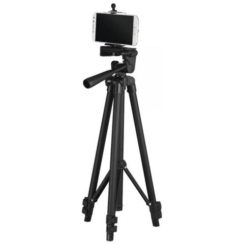

Yes, we're starting a new video podcast. As you can guess, a video podcast is.... a podcast, but with video. The difference between this and a normal YoutTube video is the format itself: it gets conducted as a conversation between friends/colleagues as it was on the radio, while a camera records everything.

Lingua franca will be Italian, and that's mainly because it's easier for us to communicate our opinions/impressions in our primary language, especially if you consider that this is our first radiophonic experience. Topics will rotate around the IT environment and software engineering in general, but we had the impression that it gets more exciting when we tackle the social aspects of being a software engineer, compared to plain technical topics.

In this article I'll try to describe why and how we're doing this, the difficulties, the joys, and the technical challenges we faced, hoping this will serve as a guide on how (NOT) to start a podcast (put a sarcastic smiling face here). During this journey, Mauro and Samith will be my brave companions.

Here you can find all the handles, in case you want to take a look (or a listen) at the podcast:

- [YouTube](https://www.youtube.com/@itcouchpodcast/featured)
- [Spotify](https://open.spotify.com/show/5EiMKEIxXGD8RIpOuPZPJZ)

## The Idea

I've known Samith for 2 years, and Mauro for a little more than a year. We all work for the same company and as you can imagine we've got a lot to share on a daily basis. So we started having virtual coffees early in the morning, talking about job stuff, challenges we're trying to solve, personal stuff, and a lot more, of course while drinking some coffee or tea. At some point, we noticed some recurring sentences during our meetings, like: "_I wish someone told me this when I was younger_", "_We should explore this topic a bit more_", or even "_We should invite X or Y super expert to these coffees_". This proceeded until someone of us said the magical words: "_WE SHOULD MAKE A PODCAST OUT OF THIS_". And yeah, here we are.

The seeds of this idea started rooting in our minds, but no concrete actions were taken yet. From that moment on it was all an "_oh, we should bring this to our podcast_", and "_this should an episode of the podcast_". Until the day we said: "_ok folks, should we do this for real?_", "_Dunno, should we?_", "_Pffff it will be VERY embarrassing_", "_yeah, another reason why we should do it (lol)!_". And then we started creating the notion project, listing possible arguments, someone worked on a very basic logo, and someday we bought cheap microphones together with cheap studio lights, and decided on a day when we would meet and record the first episode!

That's all basically. It looked like a crazy and embarrassing idea, and it's still a totally crazy and embarrassing idea, with the difference that we just... started doing stuff.

## The Technicalities

> How many engineers does it take to record a single podcast episode?
> 
> A joke that resembles reality so bad.

> _Oh c'mon, recording this podcast will be a piece of cake!_
> 
> The most foolish group of engineers on earth.

As you could guess, it was harder than it seemed. We watched many other video podcasts, and all we needed (we thought) was a camera and a microphone for each member. WRONG! Or better, not completely right.

### Video recording

A video podcast is different from a standard podcast because, of course, you need to record the video together with the audio conversation. Thanks to modern times, every basic smartphone is equipped with a 1080p camera capable of reaching 60 fps, which is perfect to start with: a good compromise between quality, storage space required and price. So we put up our phones to record a different angle each one, and looked at the resulting video. "_Wow, what's that cr@p?_". "_Why does it look so bad?_" And that brings us to the next technical challenge: "**Lights**".

<figure>

<figcaption>

Sample setup we used during recordings

</figcaption>

</figure>

### Lights

Apparently, to shoot videos with decent quality you need the sunlight at least, or A LOT of artificial light. We then discovered [Softboxe kits](https://www.amazon.it/dp/B09FDPXX9T) which mitigated our lighting problems for only 70€. These particular LED lights are good at diffusing and smoothing light in the studio, so that video subjects are not hit by directly.

<figure>

<figcaption>

Softbox lights

</figcaption>

</figure>

### Audio recording

The main idea for the podcast was to sit on a couch and talk all together with different microphones. To simplify the post-processing phase, we decided to plug all the microphones in the same computer and record it as a single audio source. We faced so many difficulties (echos, delays, audio sources not conveying on the same stream) that at some point we were forced to opt for recording each microphone's output on a separate computer. And this came with its own challenges of course. We bought very simple [condenser mics with a cardioid pattern](https://www.amazon.it/Microfono-TONOR-Condensatore-Podcasting-TC30/dp/B08CVP2HXP/), which caused all the mics to intercept every ones voice. We had to tweak all the microphones in order to catch only the owner's voice and due to that we had to talk really close to the microphone. It was hard, but in the end we came up we a good audio sample which gave us some hope.

<figure>

<figcaption>

Microphone we used.

</figcaption>

</figure>

### Recording the actual episode

It took us 3 hours to properly setup audio and video.... 3 HOURS!!! I must admit we started feeling exhausted at some point, and we weren't past the crucial point yet! We were tired but ready to start recording our episode.

Honestly, the recording went through smoothly enough. We did record the trailer, the intro/outro of the first episode, and the main content of the latter. We worked through the scripted parts as well as the off the cuff ones with no main issues, and in about 3 hours.

<figure>

<figcaption>

The clock we kept looking at while recording the episode

</figcaption>

</figure>

### Post-production

This is another part of the shooting we totally underestimated. Editing the audio and the video was a very long, tedious and crazy job. We had to find a good (free) software, learn how to use it and, ACTUALLY USE IT. It took a while, the result is not what a professional would define GOOD, but we love it as it is.

It was split in multiple phases. **Phase 1** was to merge the 3 audio files in a single stream (remember that we had to use our mics on different computers?). **Phase 2** was to select the right videos among the 5/6 hours of shootings. **Phase 3** was to merge and edit both the audio and the video.

The software we used to achieve what we achieved is [Audacity](https://www.audacityteam.org/) for the audio and [Kdenlive](https://kdenlive.org/en/) for the video.

## Conclusion

It started out as a fantastic adventure, and it looks really promising. We're forced to constantly stay out of our comfort zone because, to keep the project alive, we need to experiment new tools, try new approaches, organize our personal and professional life accordingly. The most difficult thing, at least for me, is to clarify my own thoughts! If you want to express a concept linearly, and make sure others can understand you, you first have to untie every little knot in your thinking flow, then you need to elaborate and interiorize it, and only then, you'll be able TO TRY to express it with words. It is not easy, but it's definitely a good exercise.

Creating a podcast (with video) is a though challenge, both technically and physically sometimes. It takes time, patience, and a brave heart. Because things are not going to be perfect on the first try, and you may look/sound funny at the beginning, causing general hilarity among your friends (doh!). But as for any other thing, if you want to succeed you need to be humble and persistent in your practice.

To conclude, I must endlessly thank Mauro and Samith. Without them, this whole project would not exist ❤️
