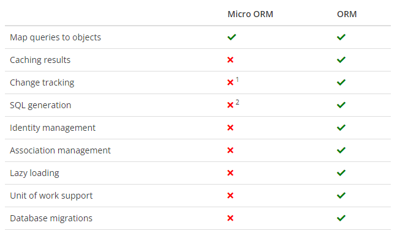

---
title: "How to use Dapper"
description: "Learn how Dapper simplifies data access in .NET with minimal code and maximum efficiency."
date: "2023-03-19"
draft: false
slug: how-to-use-dapper
tags:
  - database
  - csharp
---

## What is Dapper
Dapper is a [NuGet library](https://www.nuget.org/packages/Dapper) that you can add to your .NET projects to extend your `IDbConnection` interface. You can find the official Github repository here.

It’s an open-source micro-ORM that can be a good compromise if you don’t need all the features of a fully-fledged ORM like Entity Framework, but don’t want to deal with object mapping. With Dapper, you can execute raw SQL queries and map results to objects in few lines of code.



## The `IDbConnection`

Represents an open connection to a data source, and is implemented by .NET data providers that access relational databases. [Here](https://learn.microsoft.com/en-us/dotnet/api/system.data.idbconnection?view=net-7.0) you can read the official Microsoft documentation.

Some implementation examples are:

- [SqlConnection](https://learn.microsoft.com/en-us/dotnet/api/system.data.sqlclient.sqlconnection?view=dotnet-plat-ext-7.0&viewFallbackFrom=net-7.0): SQL Server provider
- [NpgsqlConnection](https://www.npgsql.org/doc/api/Npgsql.NpgsqlConnection.html): PostgreSQL provider
- [SqliteConnection](https://learn.microsoft.com/en-us/dotnet/api/microsoft.data.sqlite.sqliteconnection?view=msdata-sqlite-7.0.0): SQLite provider (usually an in-memory or file-based database)
You can use this interface to open/close connections, begin transactions, and create commands to be executed.

## Dapper extensions
So in short, Dapper is not a tool designed to replace standard data access APIs offered by the dotnet framework. Instead, the aim of this library is to extend the functionalities and simply the boilerplate needed to make queries or commands. Let’s see some examples.

Imagine having a `Product` table, and you want to fetch all the products. The following is an example of how you’d do it by leveraging standard `IDbConnection` methods:

```csharp
const string sql = "select * from products";
var products = new List<Product>();
 
// create and open the connection
using var connection = new NpgsqlConnection("connString");
connection.Open();
 
// create a new command and extract the command reader
using var command = new NpgsqlCommand(sql, connection);
using var reader = command.ExecuteReader();
 
// instantiate the product and map all the properties one by one
var product = new Product
{
    ProductId = reader.GetInt32(reader.GetOrdinal("ProductId")),
    ProductName = reader.GetString(reader.GetOrdinal("ProductName")),
    SupplierId = reader.GetInt32(reader.GetOrdinal("SupplierId")),
    CategoryId = reader.GetInt32(reader.GetOrdinal("CategoryId")),
    QuantityPerUnit = reader.GetString(reader.GetOrdinal("QuantityPerUnit")),
    ...
};
 
// add the product to your list
products.Add(product);
```

Not the most complex code in the world. But with **Dapper** you can simplify it down to **3 lines only**:

```csharp
const string sql = "select * from products";
using var connection = new NpgsqlConnection(sql);
var products = connection.Query<Product>(sql).ToList();
```

In this case, all the heavy lifting is done by the `Query<T>` extension method which:

- handles the connection lifecycle
- executes the query
- maps the result object

There are some more extensions available, for example:

- `Execute`: Execute a command
- `QueryFirst`: Execute a single-row query returning the first matching result
- `QuerySingle`: Execute a single-row query returning the matching result only if unique among the data set

## Conclusion
**Dapper** is an extremely handy tool that can drastically simplify developers’ life. It also seems to offer some [better performance](https://exceptionnotfound.net/dapper-vs-entity-framework-core-query-performance-benchmarking-2019/) compared to standard ORM solutions, but as usual, it’s not a silver bullet. Like any other tool it has pros and cons, and it’s up to the developer to evaluate tradeoffs when designing a new application or maintaining a legacy one.
