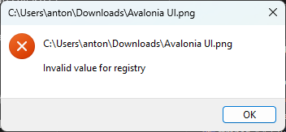
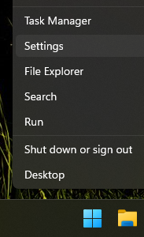
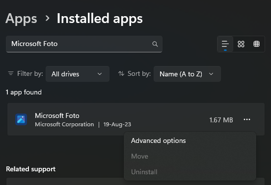

---
title: "How to Fix Invalid Value for Registry Error when Opening Photos"
description: ""
date: "2023-08-19"
draft: false
slug: how-to-fix-invalid-value-for-registry-error-when-opening-photos
tags:
  - error
  - photos
  - windows
---

Usually after a system update, it is possible that some applications, like Microsoft Photos, stop working. One of the most typical errors is `Invalid Value for Registry`, which shows up when you try to open image file:

One way to solve it is to RESET the whole application. On Windows 11 you can follow these steps:

1.  right-click on the Windows Start button
2.  click on `Settings`
3.  go to the `Apps` tab, then `Installed Apps`
4.  search for the `Microsoft Photos` app, and click on the button on the right with three points
5.  select `Advanced Options`
6.  scroll down and click on the `Reset` button

Now re-open the previous image, and this time the Microsoft Photos application show start successfully.

