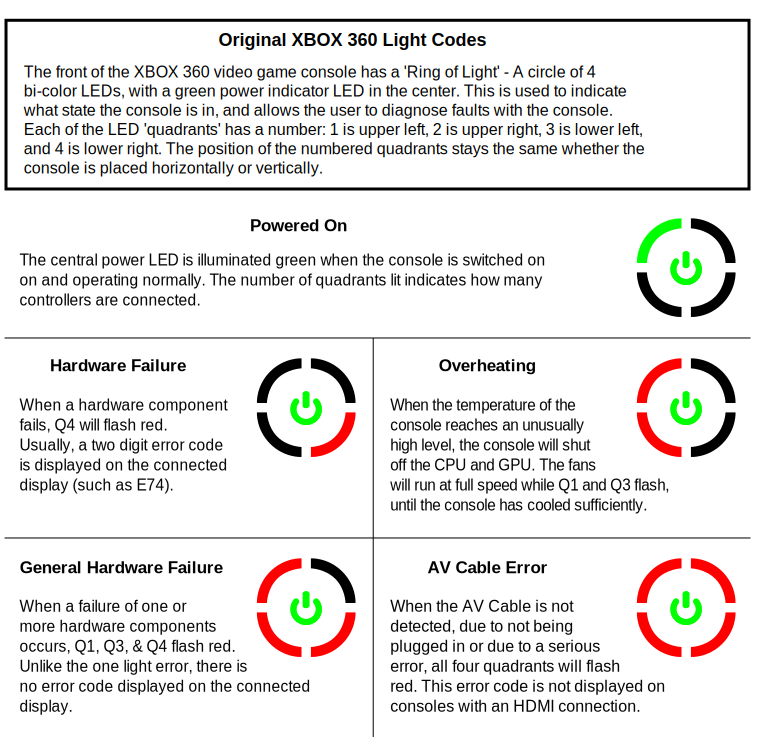
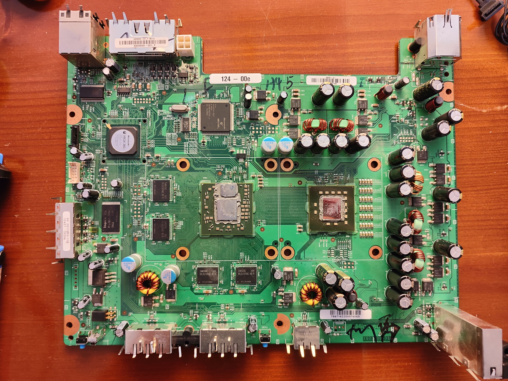
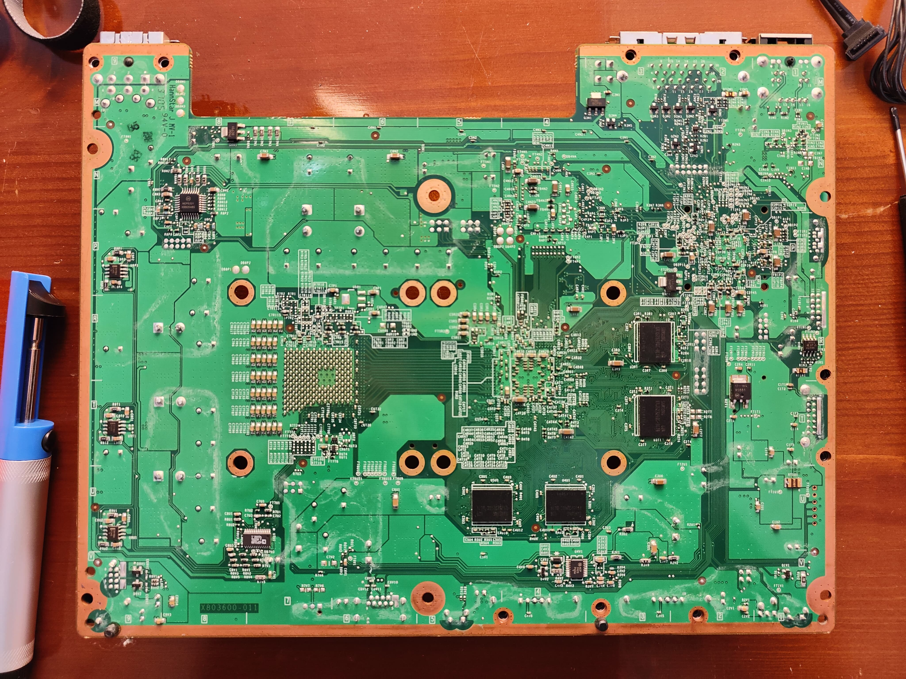
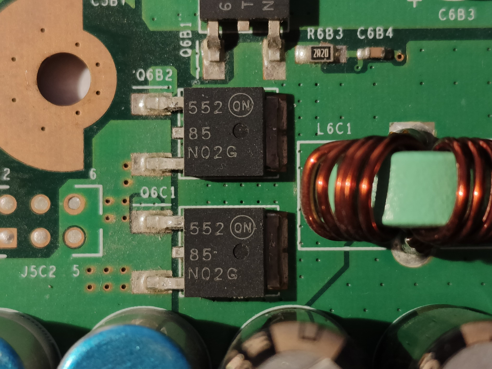

import Callout from "@/components/Callout.astro";

---

## Saving the Xbox from the landfill

One day I went to my friend's house and noticed a bunch of stuff laying on the ground with a note: "LANDFILL". Every time I see something like this I can't help snooping to see if there's anything that could be reused or brought to a second life. And it was there: a phat white Xbox 360 manufactured in 2006 (Xenon). No way this goes to the landfill!! I asked my friend what was up with that, and he said that the Xbox was not booting anymore, showing the so-called "Red Ring of Death" (aka RRoD). Well, guess what, I brought it home with me to see if I could repair it.

## The error
By pushing the start button you could hear the fans starting for a second and then shutting down immediately, with 3 out of 4 quadrants of the ring on the front panel blinking in red. Microsoft has implemented a system to identify specific errors when possible. In this case 3 red quadrants indicate a `General Hardware Failure`.

    

At this point, if nothing shows up on screen, there's a way to get more details about the issue, and it's by holding down the "sync" button and pressing the "eject" button 4 times. On every press of the "eject" button, the number of quadrants blinking in red will indicate a number as follows:
- 1 quadrant  => `1`
- 2 quadrants => `2`
- 3 quadrants => `3`
- 4 quadrants => `0`

This way you get an error code, which you can use to look up on the internet for more details about the issue. In my case it was:
- 1st press: 4 quadrants blinking
- 2nd press: 4 quadrants blinking
- 3rd press: 4 quadrants blinking
- 4th press: 1 quadrant blinking

Therefore, the error code that I got is: `0001`. By looking on the internet, this error code may represent a defect in the power supply, rather than the Xbox itself, a short within the Xbox or a blown capacitor. At this point I have no choice but to disassemble the xbox to understand what is going on.

## Disassembling

<Callout type="warning">
  Disassembling an Xbox on your own CAN BE DANGEROUS due to electricity and WILL VOID THE WARRANTY. Always refer to a specialized repair center unless you know what you are doing.
</Callout>

First thing I did was to look for a tutorial on how to disassemble an Xbox 360. One of the best is [XBOX 360 DISASSEMBLE AND CLEAN](https://www.youtube.com/watch?v=rc1jqRffaro) from the `readiysteadiy` channel. My hope is to find a huge amount of dust, maybe blocking the fans or making the heat sinks useless. But based on what I read around, the odds say that it is more likely to find a short on the board (usually capacitors or MOSFETs). Sometimes solder balls located beneath the chip can degrade, and in that case I'll have to reflow the whole motherboard to make the chips reconnect with their contacts. There's a very detailed video from **Borderline OCD**: [Xbox 360 Red Ring of Death - DIY GPU Reflow](https://www.youtube.com/watch?v=bqSKDluZMmY) on how to open, clean and reflow your Xbox 360.

Taking the Xbox apart wasn't the easiest task of the world, but neither the hardest. Once finished I used a can of compressed air to remove the dust and clean all the components. Here's some picture of front and back of this Xbox:

With the motherboard at my disposal, I started checking capacitors and transistors for shorts. This [redditor](https://www.reddit.com/r/xbox360/comments/1grmfs6/comment/ly8l0jy/) gives a very detailed explanation of how to check for short on the 12V rail. I tested the electrolytic capacitors (the big ones) and at first they appeared to be ALL shorted (using the multimeter continuity mode). BUT, switching to resistance mode, I could measure a very low resistance, so no shorts.

At this point, given that I don't see any sign of corrosion or burn, I'm not really sure of how to proceed. I've asked on reddit and a user suggested to check all MOSFETs, and if the ANA chip is seeing the `V_12P0_PWRGD` signal. Honestly, the latter is pretty obscure to me :D

The only "weird" thing that I noticed, by testing the on-board components, is that 2 MOSFETs have a very low drain-source resistance of 1.8 ohm (while turned off): Q6B2 and Q6C1. But by looking at the official schematic (found on [iFixit](https://www.ifixit.com/Document/PAsttARwWfe6WKAV/Xbox-360-Xenon-Schematic.pdf)), it seems they are in parallel with a very small resistor (R6B3), which could be why we found such low measurements.

At this point the repair is already out of my league, and I have no ideas other than disassemblying all components and check them one by one. Unfortunately I haven't got the right tools for this: I'd probably need a very precise heat gun and a pair of tweezers. Let's see if I'll need them again in the future, then I'll consider buying a set.

## The harsh conclusion

Nothing done this time. I'll see if I can sell the Xbox for spare parts, or maybe just salvage useful components, and bring the rest to the landfill. Maybe I can use the power brick to do some experiments: I've seen people doing some cool stuff with it, like a variable bench power supply, or a USB charger, and so on. I'll close the post by leaving here some more useful resources:
- [Xenon Library](https://xenonlibrary.com/wiki/Main_Page): wiki dedicated to research and documentation of the Xbox 360
- [An archive of the old repair.wiki for the Xbox 360](https://web.archive.org/web/20231004011614/https://repair.wiki/w/Xbox_360web)
- [A playlist of video around the Xbox 360 reveal](https://www.youtube.com/watch?v=ahhXw4BE2rI&list=PLKIc1-IUWhPJVuPL2jb9b1QStgmVqabYf)