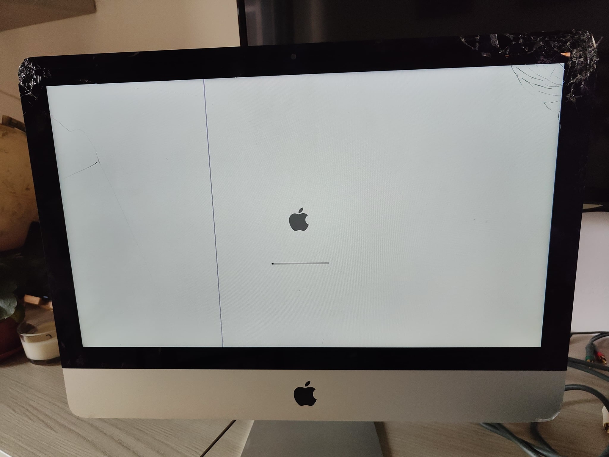

## Saving the iMac from the landfill

Same friend that gave me the Xbox 360 also had an old iMac (Late 2012) which fell down and broke the screen. He was about to throw it away, but I thought it could be a nice addition to my homelab. I asked him if I could take it home and he agreed.

## The plan

The iMac is a bit old, but it has decent specs. So I thought, better not to break it. But the desire to open it and see what's inside was too strong. Following some tutorials, I managed to open it up and remove the broken screen

plus all the other components.

Funny note, one of the Wi-Fi antennas has the shape of an apple

After some cleaning, I painted the iMac with a black spray paint, reassembled it, and now it's time to install Ubuntu.

## Installing Ubuntu

I downloaded the latest version of Ubuntu Server and used [Rufus](https://rufus.ie/) to create a bootable USB stick. I plugged it into one of the USB ports on the back, tuned the iMac on and hold down the `Option` key. This showed the boot menu with 3 options:
- `EFI Boot`
- `Windows`
- `Macintosh HD`

The USB was recognized as both `EFI Boot` and `Windows`. You can pick both and the installation will proceed without issues. But only `EFI Boot` worked 100%. The `Windows` one didn't boot after installation was completed.

Once Ubuntu was installed and booted, I realized 2 things:
- the fan was running constantly at full speed
- the screen had some weird colors

I solved the fan issue by first installing `lm-sensors` (thanks [StackOverflow](https://askubuntu.com/a/15833)) and then [mbpfan](https://github.com/linux-on-mac/mbpfan).

I still have to figure out the "purple screen issue", but it's not a big deal, because I'm gonna used it mostly through SSH. Ah right, The ethernet adapted worked out of the box.

## Conclusion
As usual, it is always an incredible feeling when you save something from the landfill. I'm planning to run some services on this iMac to experiment with Docker and Kubernetes. The last thing to figure out is where to place it. Due to its shape, it doesn't fit anywhere. I might hang it on a wall as it was a picture frame. We'll see how it goes. Cheers!