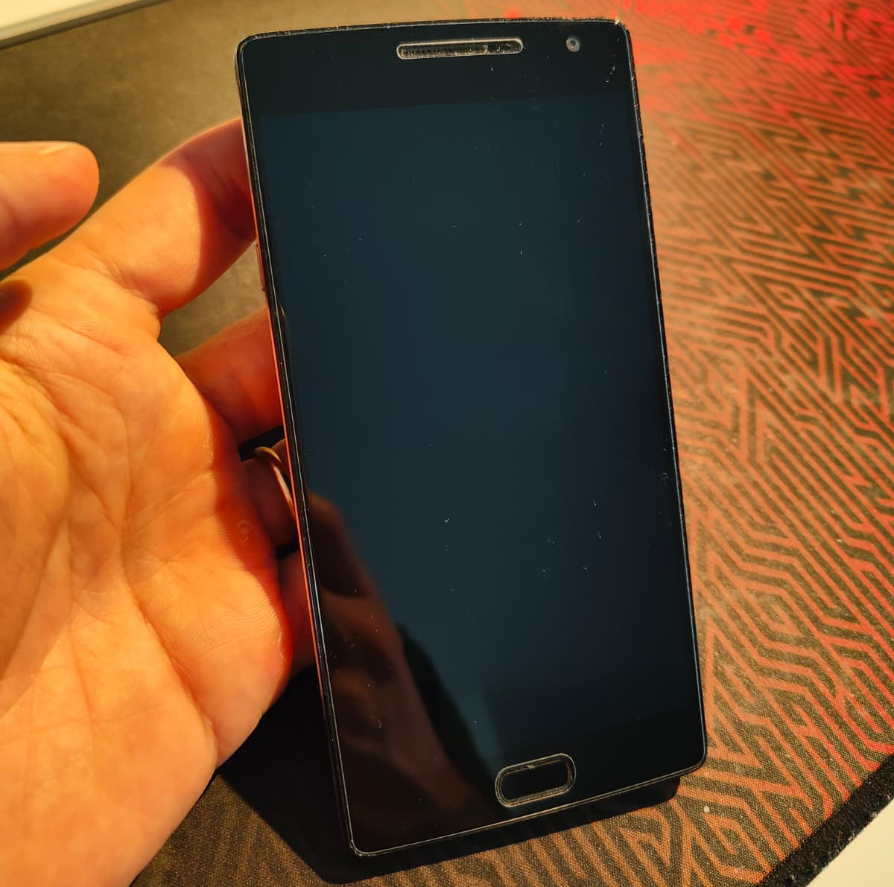
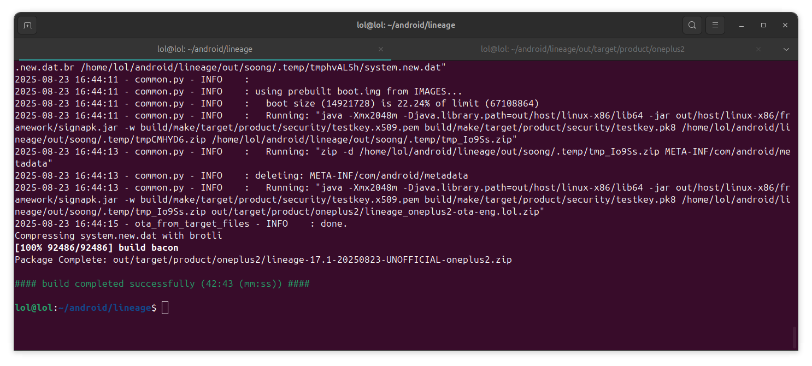
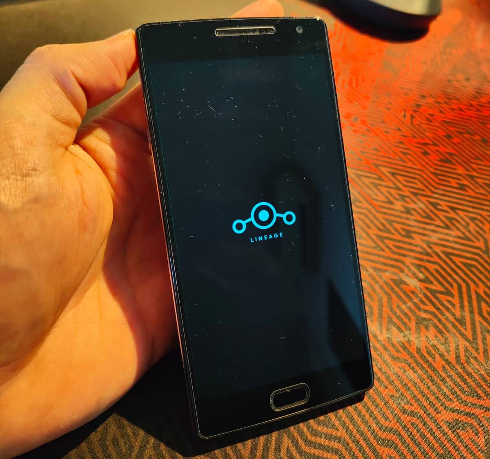

## Intro

While cleaning out my drawer of old tech gadgets, I stumbled upon my old OnePlus 2 phone that had been sitting there for years. An article about LineageOS came to mind, so I decided to give the phone a second life by installing it. 

<p style="text-align: center;">
  
</p>

## What is LineageOS?

<p style="text-align: center;">
  
</p>

[LineageOS](https://lineageos.org/) is a free, open-source OS based on Android. It seems to be the successor of CyanogenMod, and claims to give you a clean, bloatware-free Android experience.

The OnePlus 2, released way back in 2015, was long abandoned by OnePlus and my device looked pretty slow while testing it with clean new stock image. My hope here is that the device can get a new life with LineageOS (spoiler: I won't be disappointed).

## Prerequisites and a word of warning

⚠️⚠️⚠️

Before we start, a quick but important warning as usual: **flashing custom ROMs can brick your device**. I'm not responsible if things go south. Make sure you back up everything important before you begin.

⚠️⚠️⚠️

Here's what I had during this process:
- A OnePlus 2 (obviously)
- A computer with ADB and Fastboot installed (and internet access)
- Ubuntu (highly recommended as the official tutorial is based on it)
- USB cable
- About 2-3 hours of free time
- Patience (lots of it)
- A backup of your important data

I'm not reinventing the wheel here. If I managed to flash my old OP2, it was thanks to the [official LineageOS guide](https://wiki.lineageos.org/devices/oneplus2/). Unfortunately, since the OP2 is no longer supported by LineageOS, the only way forward is to **compile the OS image yourself**. Let’s go.

## A brief summary of the installation process

In short, the official tutorial will guide you through how to:
- install ADB and fastboot on your pc
- unlock the phone's bootloader
- install a custom recovery

I had some issues with `fastboot` (`no permissions (user in plugdev group....)`), and to fix it, I followed [the official Android Developer Guide](https://developer.android.com/studio/run/device#setting-up) to set up a device for development.

Once you're done with that, you need to proceed with building your own LineageOS image for your OnePlus 2.

## Building the dinosaur

Before moving on with the article, make sure you already went through the official guide, as I'll take a lot of commands/procedures from there for granted.

Unfortunately, when Lineage doesn't support your device anymore, you won't find any little cute zip file to download and flash directly on the phone. The only alternative left is to compile your own LineageOS version.

Following the guide from start to finish is... feasible. Although sometimes I had to look around for help. For instance, at some point, you have to "Extract proprietary blobs", and to do that, you need the same phone but with LineageOS already installed. But if I'm installing it for the first time, does that mean I need to find another device with LineageOS already installed? I also tried using the `./extract-files.sh` script inside the `android/lineage/device/oneplus/oneplus2` folder, but some files were missing. Perhaps it's due to proprietary files that LineageOS isn’t allowed to provide or disclose their location? I’m not sure. I might have missed some concepts at that point. However, by looking around, I stumbled upon [TheMuppets repo](https://github.com/TheMuppets), which contains [the vendor blobs I needed](https://github.com/TheMuppets/proprietary_vendor_oneplus/tree/lineage-17.1) 😬

You can either download the zip and copy it in your local copy of the LineageOS source code, or, you can edit a `roomservice.xml` located in `<lineage-source-path>/.repo/local_manifests` folder and add the following line:
```xml
<project path="vendor/oneplus" remote="github" name="TheMuppets/proprietary_vendor_oneplus" />
```

Next time you run a `repo sync`, it should fetch the required files from the right branch. Then just run `breakfast oneplus2` again to make sure everything is in place, followed by `source build/envsetup.sh`, and you should be ready to run the `brunch oneplus2` command to start the build.

The build process can be very long, and can fail sometimes. In my case the build took more than 40 mintues to complete.

<p style="text-align: center;">
  
</p>

By the way, once you're done, boot into recovery mode (hold `Volume Down + Power`), and follow the instructions from the official guide to flash your brand new LineageOS zip image on your OnePlus 2.

In case of any errors, make sure you follow **all the steps** in the official guide. They're not kidding when they show the red banner warning you not to proceed if any of the previous steps have failed. Make sure you read **everything** in that guide.

## Conclusions

<p style="text-align: center;">
  
</p>

After spending a couple of hours trying to build and flash the new image, watching the LineageOS boot animation for the first time on this old OnePlus 2, I couldn't help but smile. It took me back to those late nights as a teenager, navigating XDA forums, hoping to find help flashing some obscure custom mod.

Honestly, I was surprised by how well LineageOS runs on this 2015 hardware. It's way faster than the stock image, and the Snapdragon 810 handles basic tasks like browsing, messaging, and some light gaming perfectly.

<p style="text-align: center;">
  
</p>

Oh, and I didn't install the Play Store or Google services. The phone is now "UNGOOGLED" (I believe that's the official term). I've installed [F-Droid](https://f-droid.org/) and I'm exploring it, as it's my first time using it.

This was a really satisfying project. I'm not entirely sure if I'll use this phone yet and how, but there's something special about taking a device that's been forgotten by its manufacturer and giving it a second chance with community-driven software. The LineageOS team deserves a huge shout-out for keeping these older devices alive and kicking.

Happy flashing!