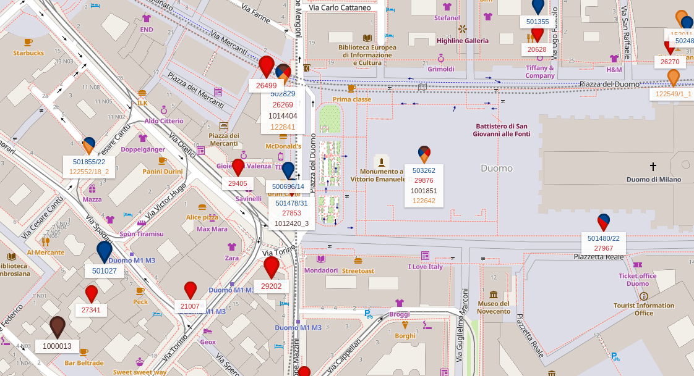

## Summary

- Lteitaly: find mobile providers antennas around italy on a map
- homelab situation

### Lte Italy

[lteitaly.it](https://lteitaly.it/) is a website which allows you to spot mobile carriers antennas spread all around italy, by navigating a simple map.
* _To see all providers on the map (instead of one by one) you need to register._

### Homelab situation

It's been a couple of months now since I started working on my tiny homelab. I started with a tiny Raspberry Pi (the first Model A IIRC) which hosted a [Pi-Hole](https://docs.pi-hole.net/) and a couple more minor services.

Then I heard about home media servers, used to stream your own media anywhere at home (and outside eventually), and so I resurrected a couple of old machines I had in the closet: two Dell OptiPlex 790 with an Intel i5-2500S and 4GB of RAM (upgraded to 16GB later on). I used to ran [Jellyfin](https://jellyfin.org/) on it, which quickly turned into the whole *arr stack. Everything was running on an internal SSD plus a couple of spare USB drives I had laying around.

Once you start tinkering with homelab's stuff, it's so easy to descend in a never-endling spiral. Although happy about my current monster setup, I was reading more and more about RAID, redundancy, High Availability, backups, and so on. At some point I discovered two new toys: [OpenMediaVault](https://www.openmediavault.org/) and [TrueNas](https://www.truenas.com/truenas-community-edition/). I started playing around using one of my Optiplex machines and reached a point where I wanted a "proper" machine with PCIe and SATA slots. I might write a dedicated article about the whole story one day, but in the end I found an old ThinkServer on a second-hand marked and pulled the trigger. Below you can see my current setup.

###