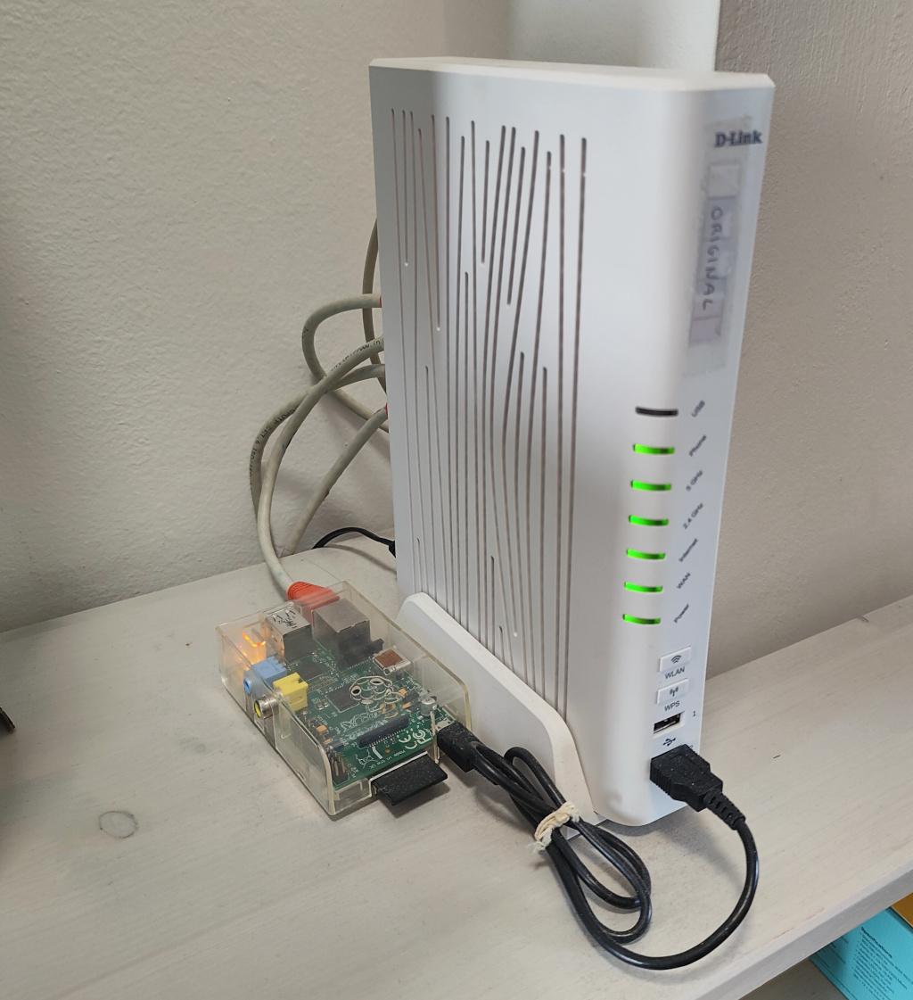
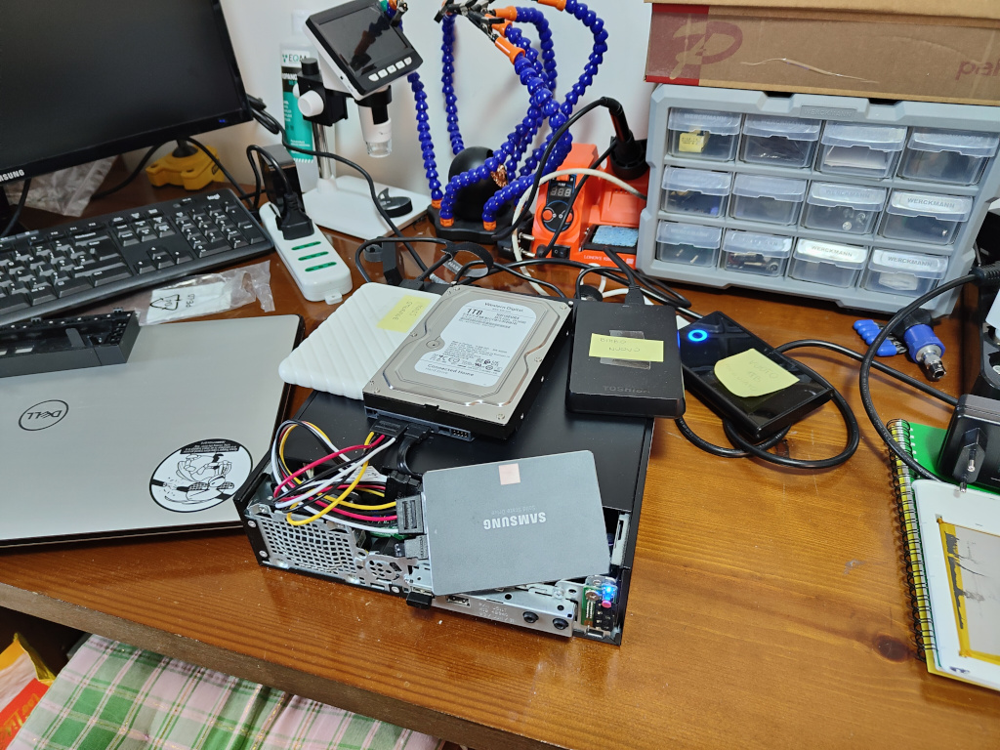
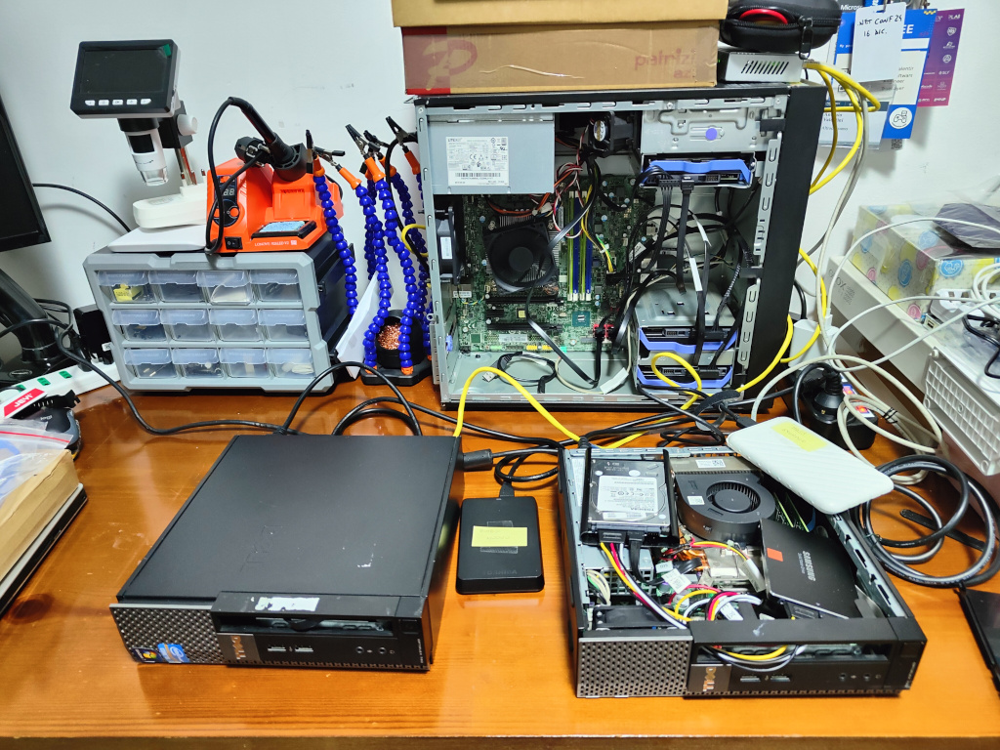

import { Image } from 'astro:assets';
import hfox1 from './images/hfox1.png';
import hfox2 from './images/hfox2.png';

## Summary

- Lteitaly: find mobile providers antennas around italy on a map
- Homelab situation
- HortusFox: self-hosted plant tracking & management
- Video: 5 styles of parenting

### Lte Italy

[lteitaly.it](https://lteitaly.it/) is a website which allows you to spot mobile carriers** antennas spread all around Italy, by navigating a simple map.

** _To see all providers on the map (instead of one by one) you need to register._

---

### Homelab situation

It's been a couple of months now since I started working on my tiny homelab. I started with a Raspberry Pi (the first Model A IIRC) which hosted a [Pi-Hole](https://docs.pi-hole.net/) and a couple more minor services.

Then I heard about home media servers, which could be used to stream your own media anywhere at home (and outside eventually), and so I resurrected a couple of old machines I had in the closet: two [Dell OptiPlex 790](https://www.dell.com/support/product-details/en-us/product/optiplex-790/overview) with an Intel i5-2500S and 4GB of RAM (upgraded to 16GB later on). I used them to run [Jellyfin](https://jellyfin.org/), which quickly turned into the whole *arr stack. Everything was running on an internal SSD plus a couple of spare USB drives I had lying around.

Once you start tinkering with homelab stuff, it's so easy to descend in a never-ending spiral. Although happy about my current monster setup, I was reading more and more about RAID, redundancy, High Availability, backups, and so on. At some point I discovered two new toys: [OpenMediaVault](https://www.openmediavault.org/) and [TrueNas](https://www.truenas.com/truenas-community-edition/). I started playing around using one of my Optiplex machines and reached a point where I wanted a "proper" machine with PCIe and SATA slots. I might write a dedicated article about the whole story one day, but in the end I found an old ThinkServer on the second-hand market and pulled the trigger. Below you can see my current setup.

---

### HortusFox

While reading hackerNews I stumbled upon this plant tracking & management application: [HortusFox](https://www.hortusfox.com/screenshots), made by Daniel Brendel. It's [open-source](https://github.com/danielbrendel/hortusfox-web), can be self-hosted and UI is pretty cool. My wife manages our balcony with a few plants. We might try this app and host it in my homelab.

  <Image src={hfox1} alt="fox1" style="flex: 1; min-width: 200px; max-width: 100%;" />
  <Image src={hfox2} alt="fox2" style="flex: 1; min-width: 200px; max-width: 100%;" />

---

### 5 styles of parenting

A video about parenting that I was suggested by so many friends. The video is made by Sprouts and explores five different parenting styles and how they impact a child's development and adult life.
These are:
- Authoritarian
- Permissive
- Authoritative
- Neglectful
- Over-involved

It's an interesting video, although I think the Authoritative style is the one with the best compromise between control and warmth, even though it seems to be put at the same level as the others. 
I can't really see the cons of that one. But I might be biased.

I loved the quote from Maria Montessori at the end of the video: "_Never help a child with a task at which he feels he can succeed_".

    <iframe
        width="560" height="315"
        src="https://www.youtube.com/embed/fyO8pvpnTdE?si=Nrmrzi3YIzbKkZoO"
        title="5 styles of parenting"
        frameBorder="0"
        allow="accelerometer; autoplay; clipboard-write; encrypted-media; gyroscope; picture-in-picture; web-share"
        referrerPolicy="strict-origin-when-cross-origin"
        allowFullScreen
    >
    </iframe>

