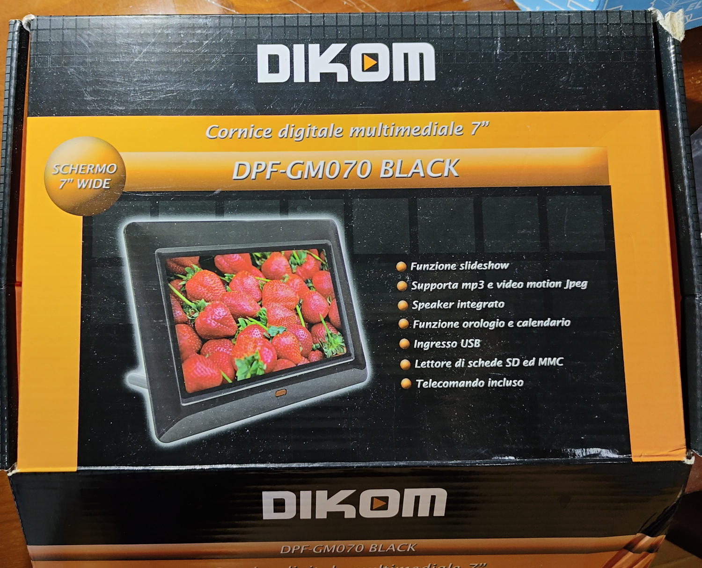
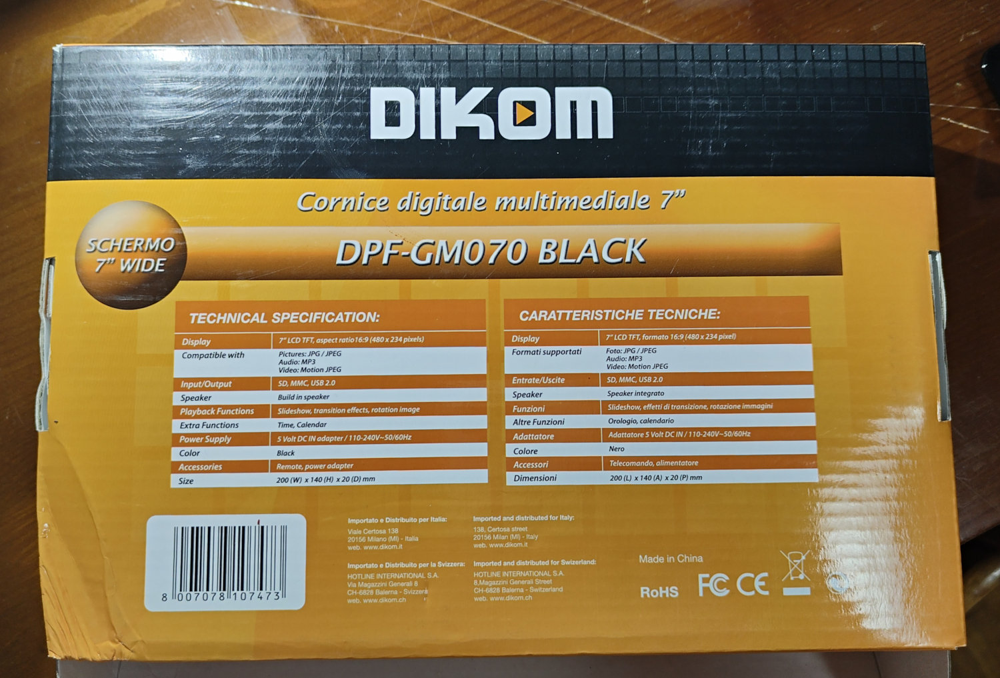
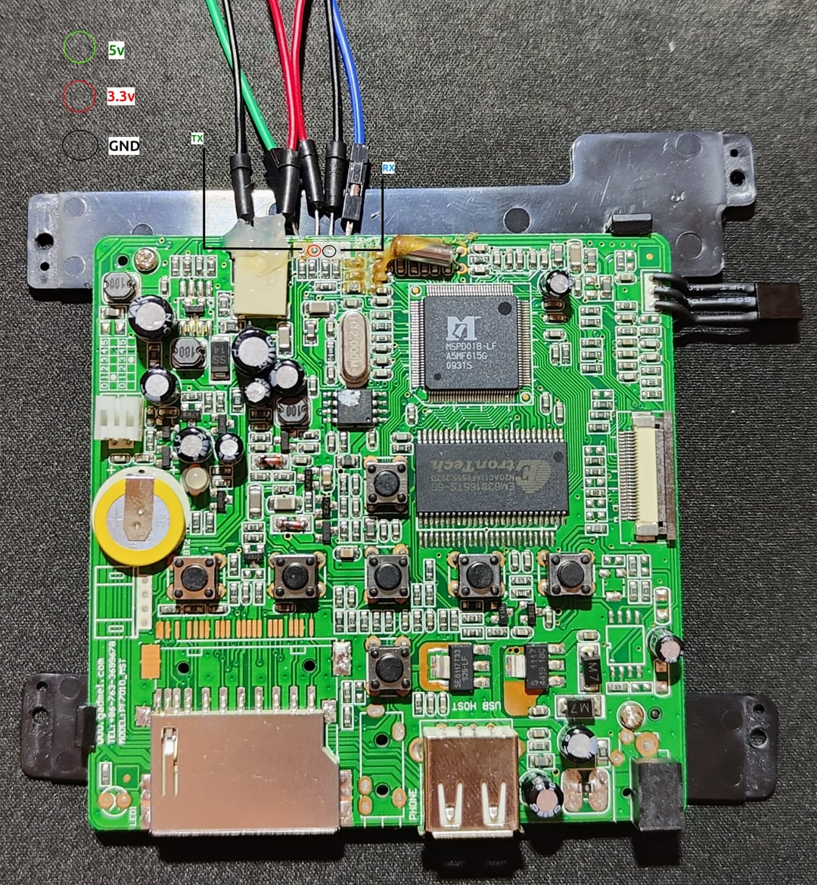
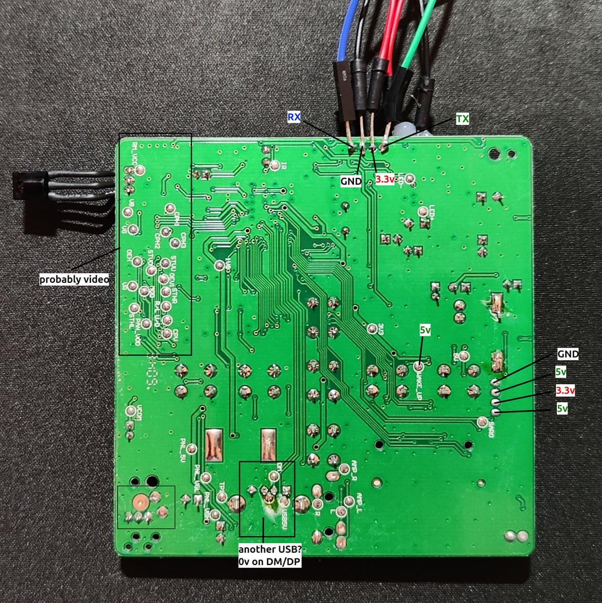
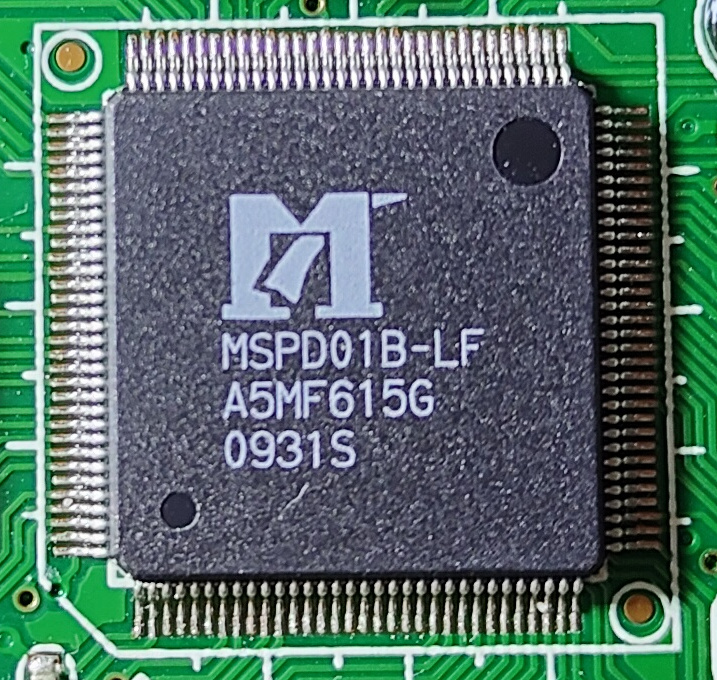
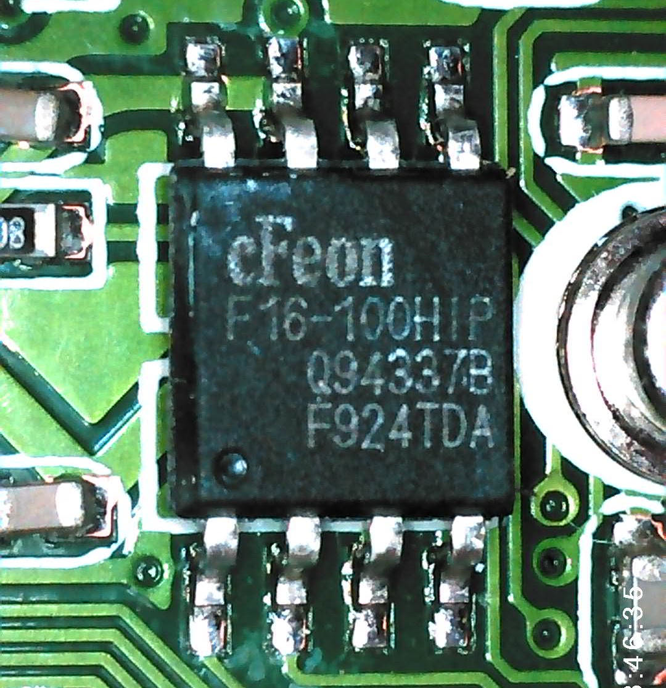
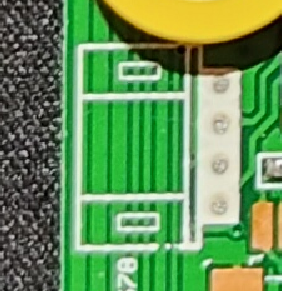

## Introduction

I've saved a digital photo frame from the bin and started poking around with its board. It's based on an `MStar MSPD01B-LF`. I managed to find the UART and got to read something from the boot sequence. Find the pastebin [here](https://pastebin.com/KhmKQCvK).

I was looking for a shell, but can't send any inputs so far. I might try desoldering the SPI memory and see if I can extract anything with a programmer.

### Conventions
Unless otherwise noted: left/right are when viewing the assembled device from the front (i.e., looking at the screen); top/bottom of the board refers to its orientation when the device is assembled and upright.

## Package

Some photos of the front and the back of the package.





### Labels

By looking at the back of the package we can see the digital frame is the model `DPF-GM070 BLACK` and is branded by "DIKOM".

Below the model we see some specifications:
- Display: 7" LCD TFT, aspect ratio 16:9 (480 x 234 pixels)
- Compatibility:
  - Pictures: JPG / JPEG
  - Audio: MP3
  - Video: Motion JPEG
- Input/Output: SD, MMC, USB 2.0
- Speaker: Build-in speaker
- Playback Functions: Slideshow, transition effects, rotation image
- Extra Functions: Time, Calendar
- Power Supply: 5 Volt DC IN adapter / 110-240V~50/60Hz
- Color: Black
- Accessories: Remote, power adapter
- Size: 200 (W) x 140 (H) x 20 (D) mm

At the bottom left, we can see the EAN-13 barcode: `8007078107473`.

At the bottom center, we can see it's imported and distributed for Italy most likely by Dikom at:
```
138, Certosa Street, 20156 Milan (MI) - Italy.
web: www.dikom.it
```

And at the bottom right, we can see that it's Made in China and follows both EU (CE: Conformité Européenne) and United States (FCC: Federal Communications Commission) regulations.

### Analysis

The domain `www.dikom.it` is currently unregistered (2026).

Last appearance on the wayback machine seems to be [during 2013](https://web.archive.org/web/20130706220116/http://www.dikom.it/it/). The website was based on [Macromedia Flash](https://en.wikipedia.org/wiki/Adobe_Flash) apparently.

Based on a quick online search, Dikom (Dikom Srl) seems to be a brand distributed by [Vesit](https://www.givesit.it/azienda/).

## Accessories
### Power Supply
This DPF-GM070 came with a GADMEI PA005A-05010EU power adapter (5V DC 1.0A). The barrel plug is center-positive. Unloaded, it seems to supply roughly 5.23V.

### Remote Control
The remote control is IR-based and has 11 buttons. It runs on a CR2025 battery held within a removable tray. The buttons are:
```
[POWER]                   [SETUP]
              [UP]
[LEFT]        [ENTER]     [RIGHT]
              [DOWN]
[SLIDE SHOW]              [ROTATE]    
```

## Components
Here's a picture of the front and the back of the board. Components on the front of the board are not labelled. Only some pins on the back of the board are labelled.

**FRONT**


**BACK**


### Screen

The screen is a TFT (Thin-Film Transistor) 480x234 pixels made by Chi Hsin Electronics Corp (also called ChiHsin). An orange/brown polyimide FFC (Flexible Flat Cable) with white text extends from the front of the device below the screen. It connects to a 26-pin FFC connector on the right of the board. On the back of the screen, there are a bunch of labels, but the one we're interested in is the one with `LR700BA9005` which should be the model ([Panelook specs](https://www.panelook.com/LR700BA9005_Innolux_7.0_LCM_overview_1455.html)).

#### Backlight

A pair of wires (red and white) emerges from the left side of the screen. The connector is a JST BHS ([archive](https://web.archive.org/web/20230806070808/https://www.jst.com/products/crimp-style-connectors-wire-to-board-type/bhs-connector-w-to-b/)) type. It has a pitch of 3.5mm and is keyed to only fit in one orientation. The plug is made of white plastic and mates with a natural white-colored jack on the left of the board.

### SoC


The MStar MSPD01B SoC is a 128-pin QFP (Quad Flat Package). It is located towards the middle on the top of the PCB and marked:
```
MSPD01B-LF
A5MF615G
0931S
```
The apparent date code would seem to indicate the 31st week of 2009.

Based on this [GitHub Gist](https://gist.github.com/throwaway96/1afce958952ffe458a9ab635095311f2#soc), the MSPD01B is part of a family of similar chips intended for use in digital picture frames.

### SPI flash



The chip is a cFeon (EON Silicon Solution Inc.) `EN25F16-100HIP`. [Datasheet](./files/EN25F16.PDF).

Specs:
- Type: SPI (Serial Peripheral Interface) Flash Memory
- Capacity: 16 Megabit (Mbit)
- Clock Speed: Up to 100MHz (indicated by the "-100" in the part number)
- Voltage Range: 2.7V to 3.6V (Standard 3.3V operation)
- Package Type: 8-pin SOP (Small Outline Package) / SOIC, 208mil body width

The small circular indentation (dot) in the bottom left corner of the chip should be the `Pin 1` indicator.

### RAM
There is a single Etrontech EM638165TS-6G ([datasheet](./files/EM638165TS-6G.PDF)) SDRAM IC in a 54-pin 400mil TSOP package at the top of the board below the MStar SoC. It is organized as 4 banks of 1M 16-bit words, for a capacity of 64Mbit (8MByte). Its 6ns cycle time equates to a frequency of 166MHz.

### Buttons
There are 7 buttons, actuated via a flexible plastic insert in the case.

### Crystals
There is what appears to be a standard 32.768KHz "watch" crystal immediately at the top of the SoC. There is also a surface-mount crystal marked "H12.000M" on the left of the SoC.

### Battery
There is what looks like a CR1220 battery on the left side of the top of the board. Its positive side is facing up, with a terminal spot welded to it in two places. There appears to be a similar spot-welded terminal on the bottom (negative) side. The terminals form a through-hole connection to the board, with the positive being towards the rear. The battery seems to be wrapped in a yellow plastic heat-shrink insulator.

### IR receiver
There is a front-facing 3-pin IR receiver IC, placed top right on the front of the board. It is able to receive light through a small grille in the black plastic bezel (although the entire area is still covered with clear plastic).

### Unknown pins



Towards the left edge of the front board, there is a section of 4 unknown pins.
Starting from the top, this is the result of a quick measurement:
1. GND
2. 5v
3. 3.3
4. 5v 

Pin 4 seems to be coming straight from the DC jack. That makes me think this section is some sort of power diagnostic header.

### Unpopulated footprints
The section labeled PHONE, between the card reader and the USB port at the bottom of the board, looks like the footprint for a 3.5mm Headphone Jack.

The horizontal row of copper pads located directly above the existing SD card slot seems to be the footprint for an eventual Multi-Card Reader assembly.

### Silkscreen text
There is some information written at the bottom left on the front of the board:
```
www.gadmei.com
TEL: +86-763-3699678
MODEL: PF7010_MST
```

Gadmei might be the original manufacturer of the board. PF7010_MST might be Gadmei's internal model number and MST might indicate that this board variant was built specifically for the MStar chipset family. I wonder if there are any factory firmware files still around.

## UART

The UART is accessible via a 4-pin section on the top of the board, right beside the screen backlight connector. I had to solder the wires directly on the pins in order to access it. The baud rate is 38400.

### Output

Here you can find the first ~40 lines of the UART output on boot:

```
* SPI flash clock 36 MHz
MIU clock running in 144MHz by default...
Initialize memory...
Reset PLL completed
Memory initialization completed .
Memory self test completed .
ECC cache reset
ECC cache ON
MCU read burst ON
ISB burst mode ON
* Switch CPU from 12MHz to 120MHz ... complete.

[Ceramal basic initialization complete]

----------------------------------------------------------------------
## Aeon memory require = 589824 (0x90000) bytes
## Remaining memory: 0x00393c00 - 0x00393c00, size=0 (0x0) bytes
Application runs.
Move code from SPI to DRAM ...done.
doinig gamma setup with table value

[MApp_Init] entry

[MApp_ReadCfgFromFlash] proname = CERAMAL$

[MApp_ReadCfgFromFlash] verion = 1.5
[boot]dstaddr:3244032

decode done... should be
Aeon image offset = 0xa0200, size=0x5b660
Successfully copied Aeon image into DRAM
# AEON reset & enable ...

..Set SPI  base to 0xf0000000

..Set QMEM base to 0xC0000000


Start msAPI_MIU_Get_BinInfo()

Start msAPI_MIU_Get_BinInfo() success!

osdcp_text_addr=11f400
```

[Here's the full output](./files/uart-dump.log).
