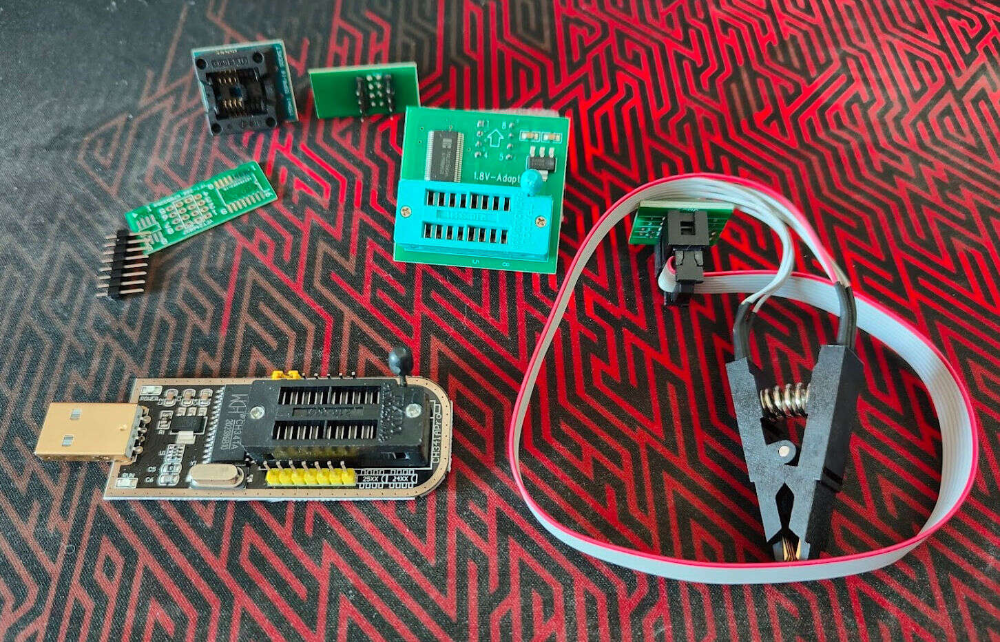
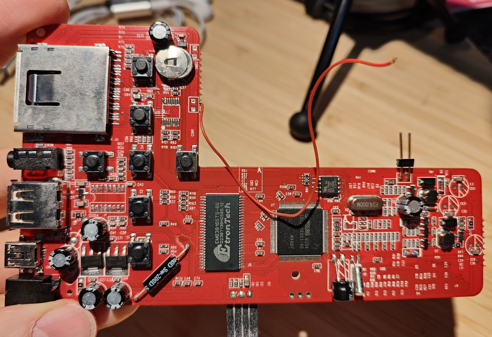
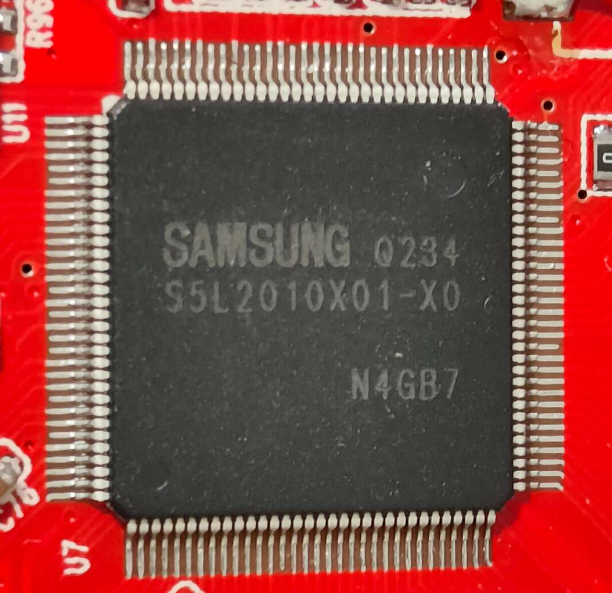
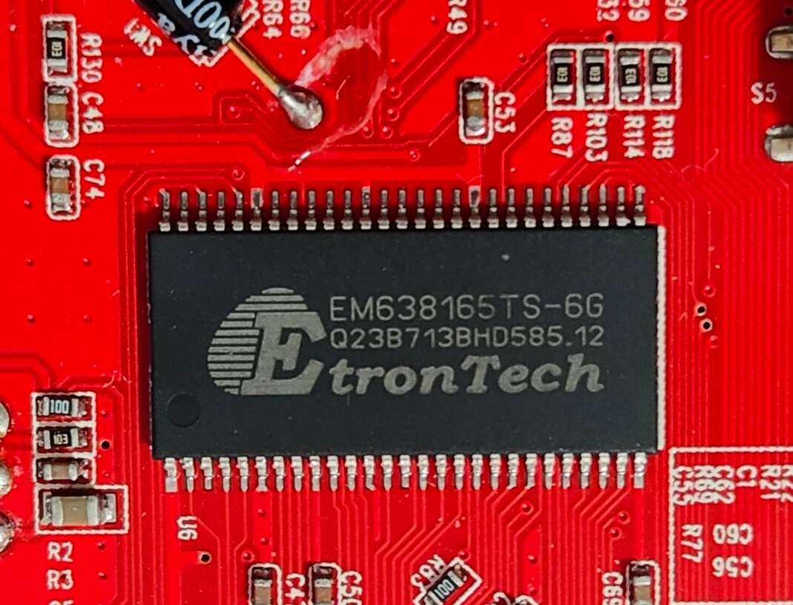
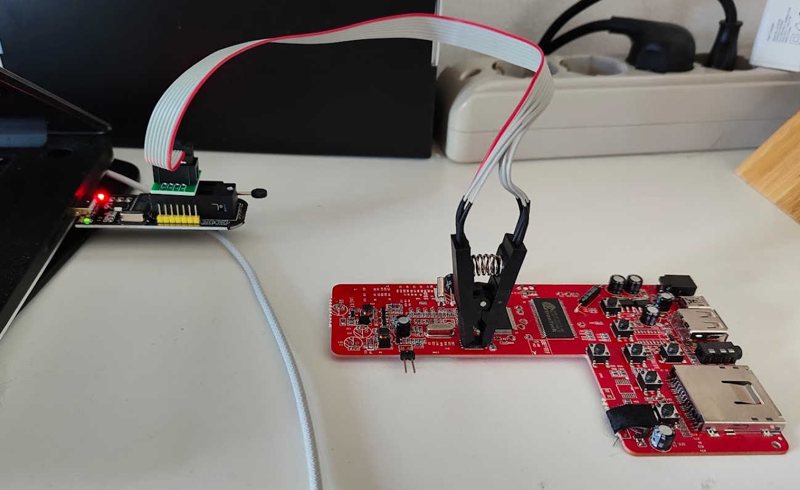
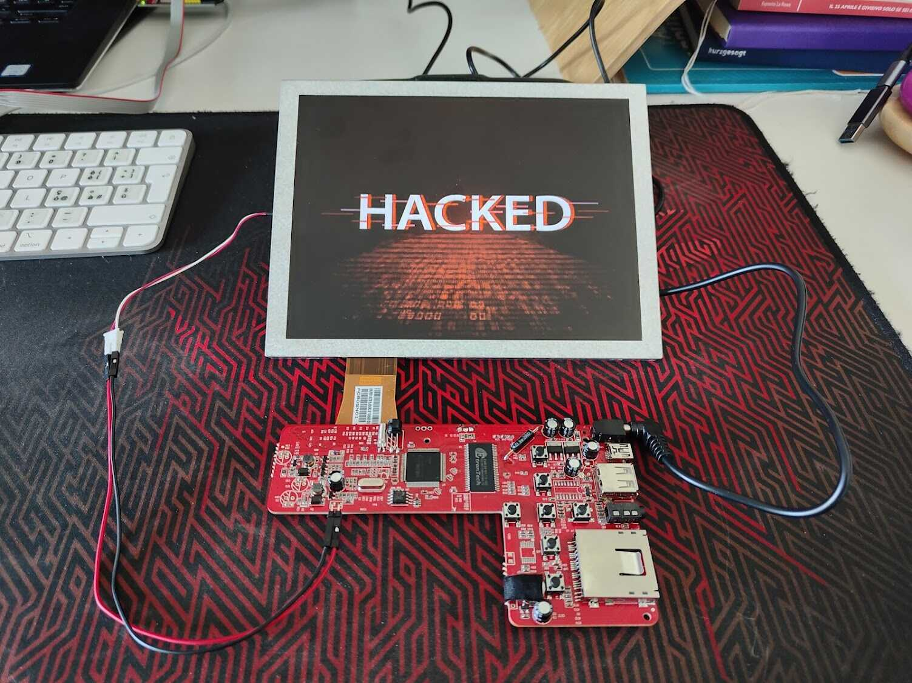
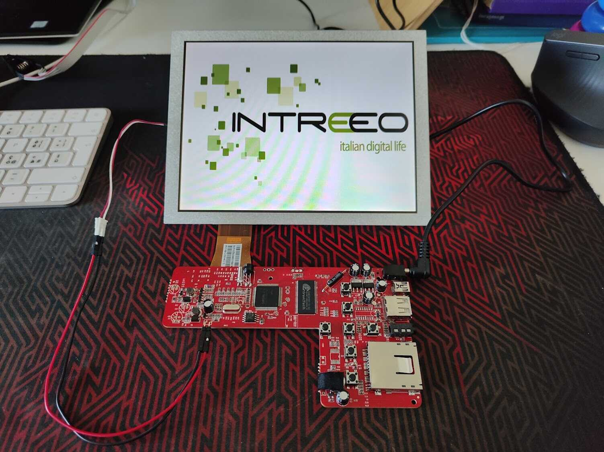
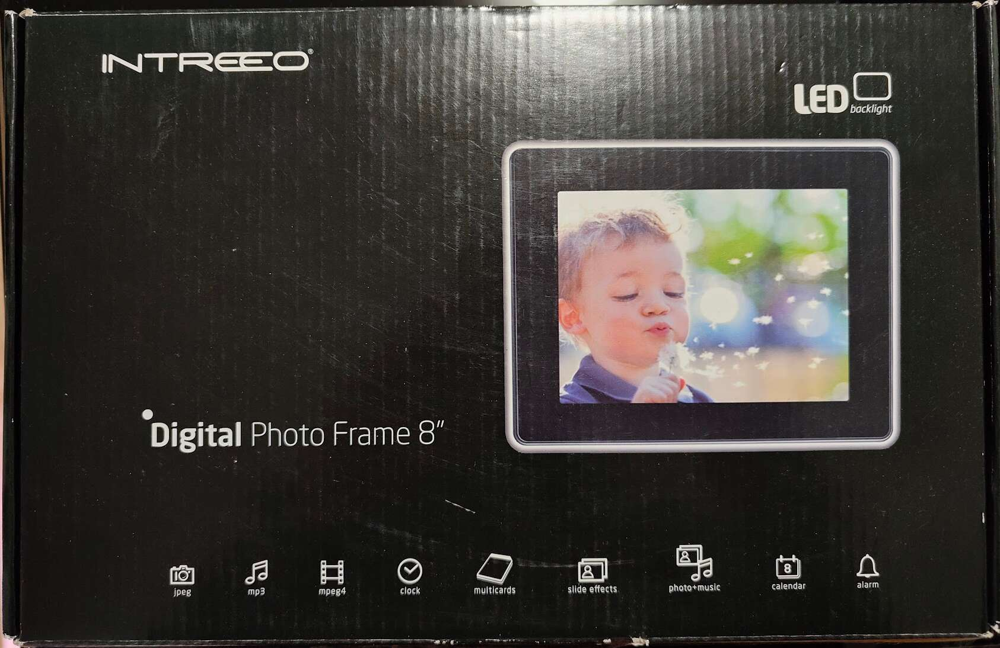
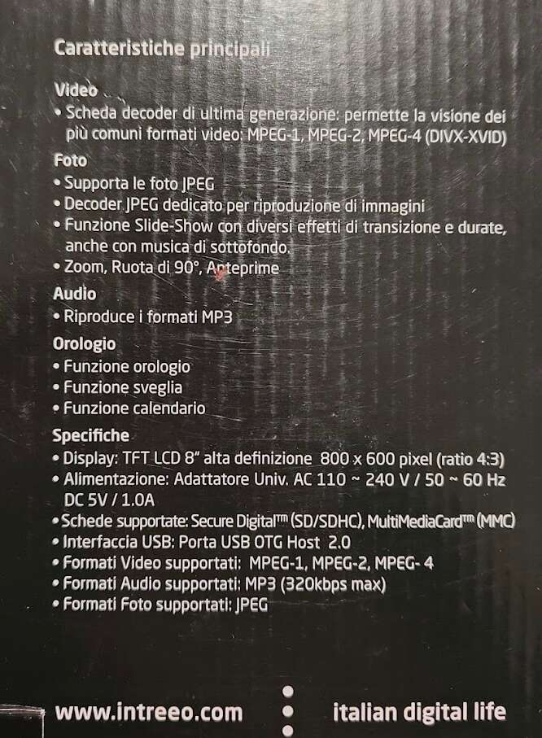
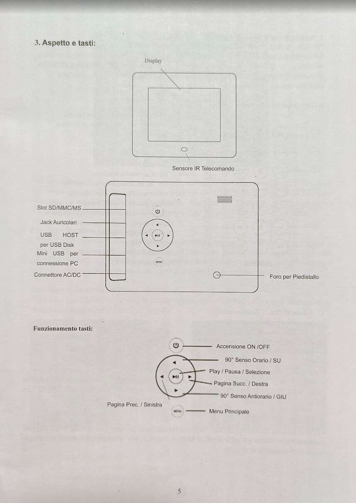

import { Image } from 'astro:assets';
import spi1 from './images/spi.jpg';
import spiDetails from './images/spi-details.jpg';
import Callout from "@/components/Callout.astro";

<Callout type="warning">
  This is a very basic introduction to firmware extraction and modification, and it's not meant to be a comprehensive guide. It can permanently damage your device if not done correctly, so proceed with caution and always work on a copy of the firmware dump.
</Callout>

A couple of weeks ago, I was [fiddling around with a DIKOM digital photo frame](https://antoniovalentini.com/blog/0023-dpf-dikom/) (DPF), analyzing the hardware and looking for UART. Recently I managed to intercept another DPF that was destined for the landfill and did the same. This time, though, I wasn't able to find any UART, and a friend suggested to buy a cheap CH341A programmer, to read the SPI flash and see whether I could find anything interesting. The programmer arrived with a couple of adapters, although I'm not really sure of how to use them all. What I needed for now was the programmer itself and the SOP8 clip.



But before we dig into the firmware extraction, let's take a closer look at what we have in hand.

## Components

Here's a main view of the front of the PCB:



### SOC

Model: `Samsung Q234 S5L2010X01-X0 N4GB7` - [Datasheet](/blog/0025-hacking-dpf-intreeo-firmware/files/Samsung-S5L2010X01-X081.pdf)

<div style={{ display: 'flex', justifyContent: 'center' }}>
 <div style={{ width: '80%' }}>
  
 </div>
</div>

### Memory

Model: `EtronTech EM638165TS-6G` - [Datasheet](/blog/0025-hacking-dpf-intreeo-firmware/files/EtronTech-EM638165TS.PDF)

<div style={{ display: 'flex', justifyContent: 'center' }}>
 <div style={{ width: '80%' }}>
  
 </div>
</div>

### SPI flash

Model: `Macronix MX25L1606E` - [Datasheet](/blog/0025-hacking-dpf-intreeo-firmware/files/Macronix-MX25L1606E.pdf)

That's the chip we are interested in. A 16-Megabit (2 MB) Flash memory chip manufactured by Macronix. The chip is in a SOP8 package, which means it has 8 pins and it's where the firmware is stored. The pins are usually arranged in a way that makes it easy to connect a clip and read/write the firmware without having to desolder the chip. We only need to pay attention to the VCC and the Pin 1 position, which is usually marked with a dot or a notch on the chip. This chip runs at 3.3V, so there's no need to use an adapter.

<Callout type="warning">
   Always check the voltage output of your programmer before connecting it to the chip. If it outputs 5V, do not connect it to the chip, as it will likely damage it.
</Callout>


<div style="display: flex; gap: 1rem; align-items: center; flex-wrap: wrap;">
  <Image src={spi1} alt="spi1" style="flex: 1; min-width: 200px; max-width: 100%;" />
  <Image src={spiDetails} alt="spiDetails" style="flex: 1; min-width: 200px; max-width: 100%;" />
</div>

## Firmware extraction

After watching a couple of video-tutorials, and reading [this blog post](https://www.blackhillsinfosec.com/dumping-firmware-with-the-ch341a-programmer/) that showed exactly how to connect the adapter and the clip to the SPI programmer, I managed to get the clip working, and with the help of [flashrom](https://github.com/flashrom/flashrom), I was able to read the whole firmware within the chip. The process is pretty straightforward, although you might need to "fiddle" with the clip in order to get the 8 pins to properly connect with the chip.



<Callout type="error">
  Make sure the device is completely unpowered and unplugged before connecting the SOIC-8 clip. The CH341A supplies 3.3V to the flash chip through the clip. If the board is powered at the same time, you risk destroying the chip, the programmer, or both.
</Callout>

Before running any commands:
1. Connect the CH341A to your computer via USB.
2. Orient the SOIC-8 clip so the red wire aligns with Pin 1 on the chip (the dot or notch end).

To read the firmware, run:

```bash
sudo flashrom -p ch341a_spi -c "MX25V16066" --progress -r read1.bin
```

`ch341a_spi` is the programmer and `MX25V16066` is the closest chip model that is available in flashrom.

It might take from 30 seconds to a couple of minutes, depending on the size of the firmware. In my case, it took around 30 seconds to read 2MB of data.

Before doing anything else, read the chip a second (or third) time and compare checksums. If the two dumps differ, the clip contact is unreliable. Just reseat it and try again.

```bash
sudo flashrom -p ch341a_spi -c "MX25V16066" --progress -r read2.bin
md5sum read1.bin read2.bin
```

Both hashes must match before you proceed.

Once you have a firmware dump, people usually analyze it using a reverse engineering framework like [Ghidra](https://github.com/NationalSecurityAgency/ghidra), but that's too much for me right now. Something more approachable might be to look for the splash screen image and try to replace it with a custom one. Something that screams "I've been here".

I used `binwalk` (`v3`, you can find it [here](https://github.com/ReFirmLabs/binwalk)) to look around the firmware. With binwalk you can identify, and optionally extract, files and data embedded in other files. You can even use `dd` to extract the data manually, but binwalk does it for you and is (usually) more reliable.

```bash
➜ binwalkv3 -e read1.bin

/home/******/read1.bin
-----------------------------------------------------------------------------------------------------------
DECIMAL                            HEXADECIMAL                        DESCRIPTION
-----------------------------------------------------------------------------------------------------------
6144                               0x1800                             RAR archive, version: 4, total size:
                                                                      0 bytes (failed to locate RAR EOF)
857600                             0xD1600                            JPEG image, total size: 49327 bytes
919040                             0xE0600                            JPEG image, total size: 44381 bytes
1149440                            0x118A00                           JPEG image, total size: 85882 bytes
1235456                            0x12DA00                           JPEG image, total size: 98614 bytes
-----------------------------------------------------------------------------------------------------------
[-] Extraction of rar data at offset 0x1800 failed!
[+] Extraction of jpeg data at offset 0xD1600 completed successfully
[+] Extraction of jpeg data at offset 0xE0600 completed successfully
[+] Extraction of jpeg data at offset 0x118A00 completed successfully
[+] Extraction of jpeg data at offset 0x12DA00 completed successfully
-----------------------------------------------------------------------------------------------------------

Analyzed 1 file for 111 file signatures (251 magic patterns) in 41.0 milliseconds
```

The command analyzed and extracted the files embedded in `read1.bin`. By looking at the `extractions` folder, the image at offset `0xD1600` seems to be the splash screen (`49327` bytes or `C0AF` in hexadecimal). To replace it, we need to create a new image with the same dimensions (`800x600`) and the same or smaller size, so that we don't override other data.

If you want, you can extract the original image manually with `dd`:

```bash
dd if=read1.bin of=orig.jpg bs=1 skip=$((0xD1600)) count=$((0xC0AF))
```

To create a custom image, I downloaded a free stock one, and used [GIMP](https://www.gimp.org/) to resize it to `800x600` and reduce the quality until I got a file smaller than `49327` bytes. There are command-line alternatives like `convert` from ImageMagick as well.

Once we have our custom image, if it's smaller than the original one, we can use `truncate` to fill the remaining space with zeros (remember to always work on a copy). This prevents any leftover bytes from the original image from corrupting the new splash screen.

```bash
truncate -s 49327 modded.jpg
```

Now we can write the modified image back to the firmware dump (here again, always work on a copy):

```bash
dd of=mod.bin conv=notrunc if=modded.jpg bs=1 seek=$((0xD1600))
```

And finally, we can write the modified firmware back to the chip:

```bash
sudo flashrom -p ch341a_spi -c "MX25V16066" --progress -w mod.bin
```

A good sign that things went well is the successful verification message at the end of the process:

```
Verifying flash...
[READ: 100%]...VERIFIED.
```

If you see any errors, double check the original and modified firmware dumps have the same size, and do the same for the original and modified images.

```bash
ls -l read1.bin mod.bin

ls -l orig.jpg modded.jpg
```

If everything went well, unplug the clip, power on the DPF and enjoy your custom splash screen!



For reference, this was the original one:



## Extra images

### Front package

<div style={{ display: 'flex', justifyContent: 'center' }}>
 <div style={{ width: '80%' }}>
  
 </div>
</div>

### Back package

<div style={{ display: 'flex', justifyContent: 'center' }}>
 <div style={{ width: '80%' }}>
  
 </div>
</div>

### Manual page

That's the only manual page I kept, because I'm interested in the USB HOST port. In the future I might try to see whether I can use it to access the firmware or the memory, without having to use the SPI flash programmer.

<div style={{ display: 'flex', justifyContent: 'center' }}>
 <div style={{ width: '80%' }}>
  
 </div>
</div>
