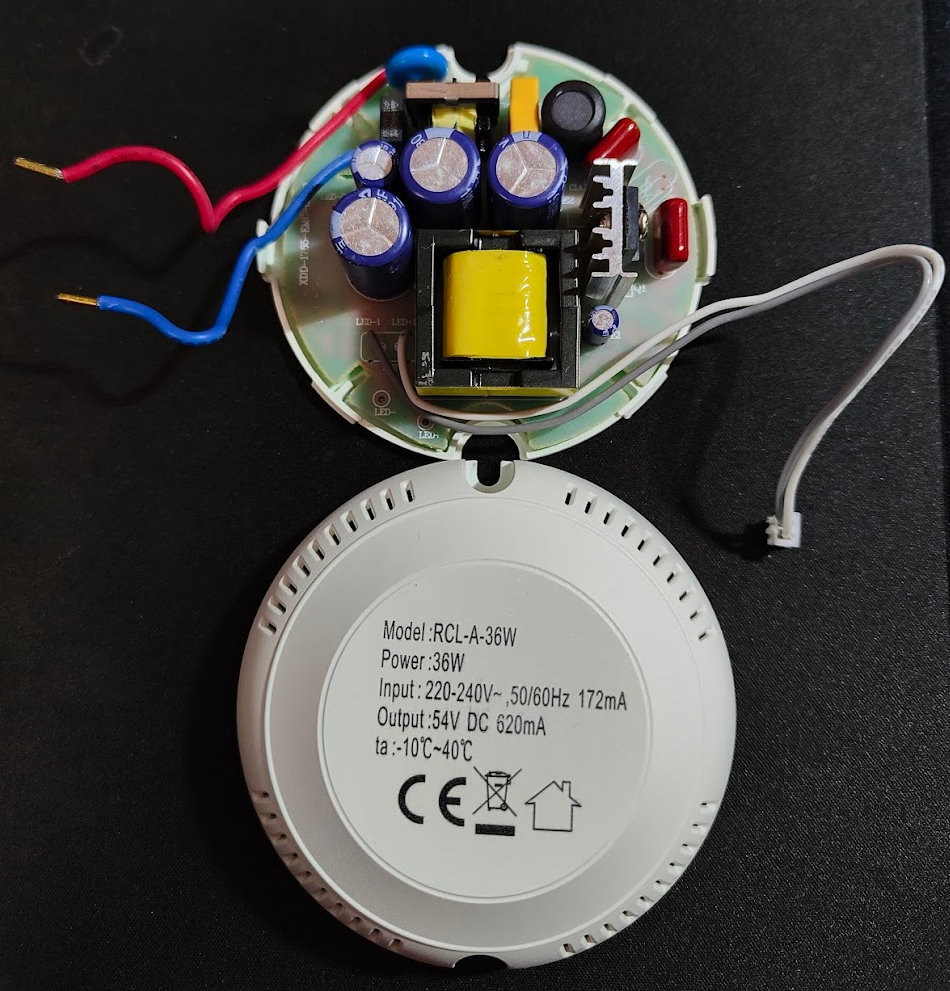
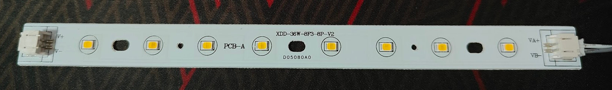
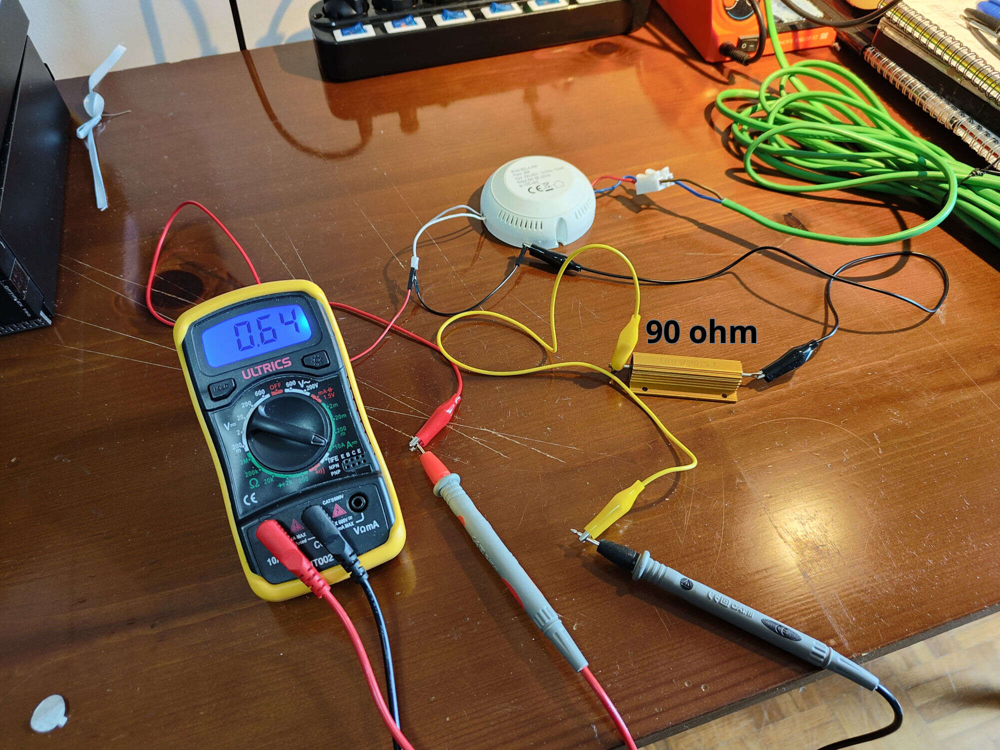
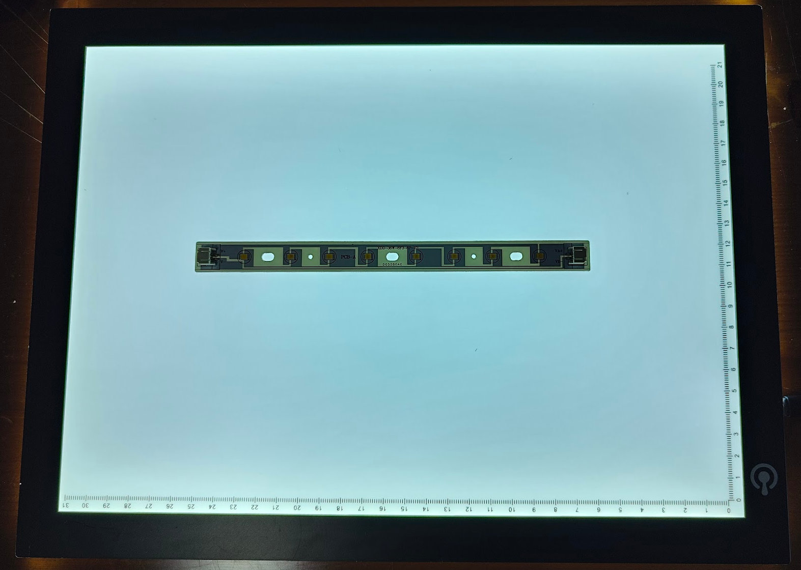
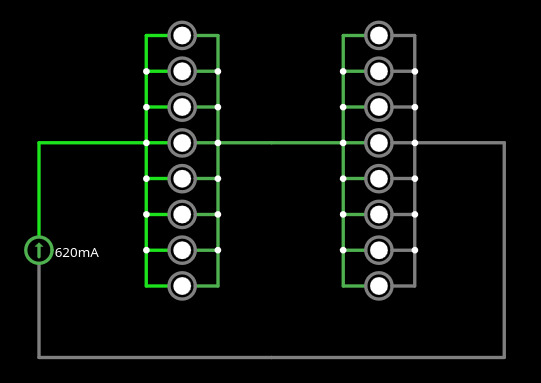
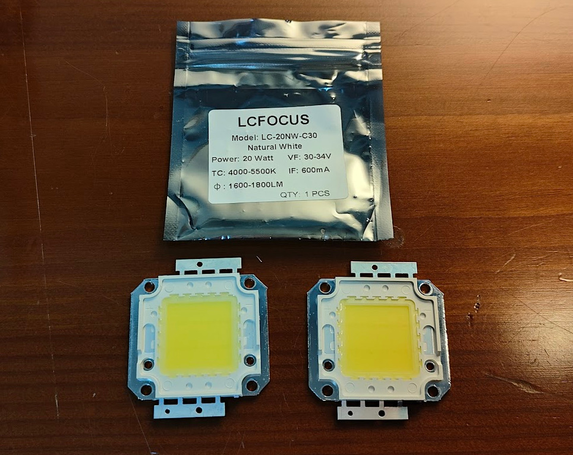
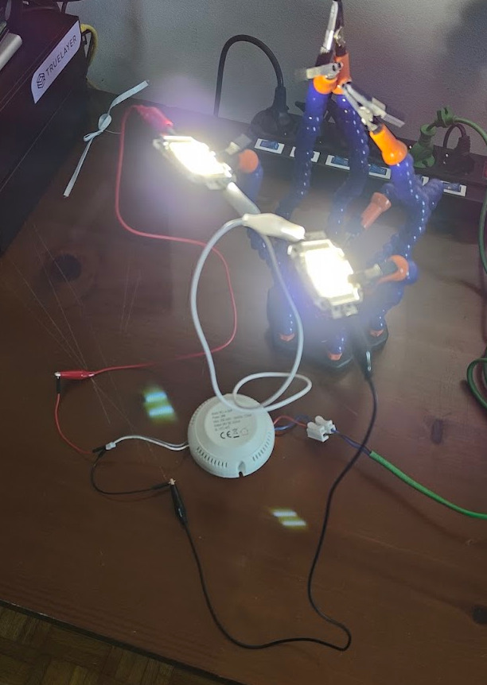
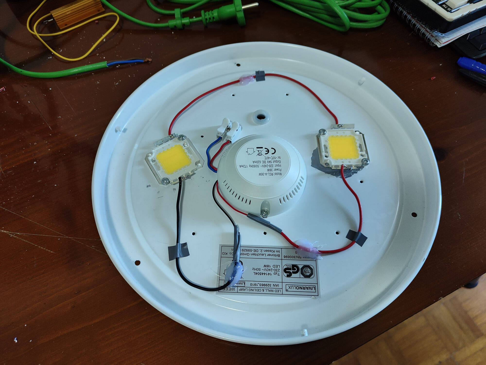
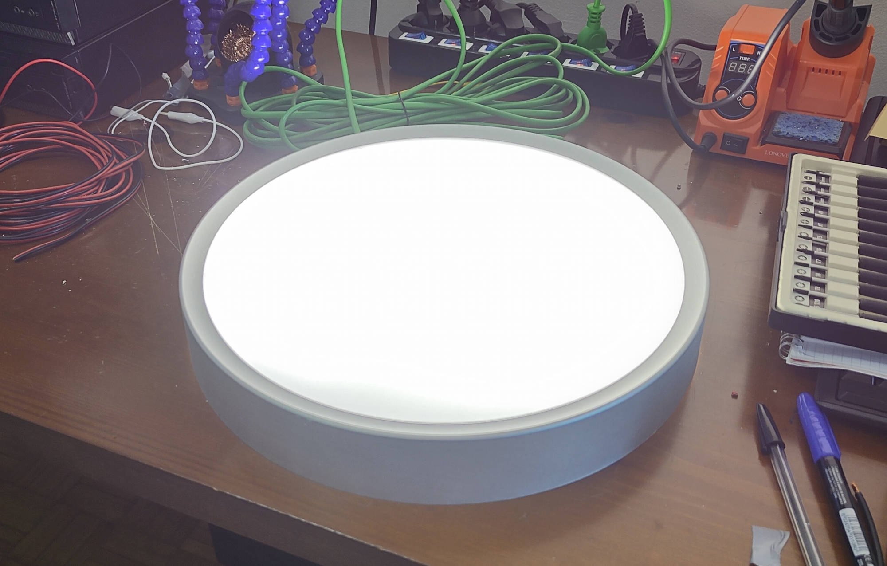

import Latex from "@/components/Latex.astro";
import Callout from "@/components/Callout.astro";

<Callout type="warning">
    This article is not meant to be a comprehensive guide. Working with mains or high DC voltage can be dangerous for you and your devices. Do not attempt this if you don't know what you're doing.
</Callout>

## Introduction

Last year, one of my ceiling lamps stopped working. It was a standard LED strips lamp inside a plastic enclosure. I knew nothing about LEDs, but one of the strips had some LEDs visibly burned. I bought a new one and kept the old one for later times, when I'd be able to investigate what failed without any hurry. And that time has come.

The electronics consists of 2 main components: the LED driver and the LEDs (LED strips in this case).

Simplifying things, an LED driver is a power supply which provides a constant current by varying the voltage (if necessary). This driver provides a constant current of `620mA` at `54V`, as nominal voltage, for a grand total of `~36W`. The unknown here is the characteristics of the LED strips. The lamp comes with 6 strips, each one made of 8 LEDs.

## Investigation

### Check driver's voltage and current

At that point I wanted to check whether the driver was supplying the right current at the right voltage. So I plugged the driver to the mains, pulled out my tester and measured the voltage with no load. Result: `90V`. Is that broken then? Hmm, maybe not. I did a quick research and apparently the driver tries its best to push those `620mA`, and when the resistance is too high (air in this case) it tries to increase the output voltage up to its open-circuit compliance limit. This is not good for the driver's health apparently, so I turned it off.

What's left to check now is the constant current. I need a "dummy load" for that (a power resistor) that I can use to make the driver function at nominal "speed".

To simulate the "Happy Zone" of the driver (which is labeled at `54V`), we use Ohm's Law:

<Latex formula='R = \dfrac{V}{I}'/>

- Target Voltage: `54V`
- Constant Current: `0.62A (620mA)`
- Calculation: `54V/0.62A≈87Ω`

A `90Ω` resistor should work well for this test, as long as it is rated for at least `50W` (I bought a `100W` one), since at `620mA` it will dissipate roughly `38W` of power:

<Latex formula='P = I^2 \times R \approx 38\,\text{W}'/>

Luckily, it did work. In the following picture you can see the driver turned on, with my tester in series measuring `0.64A` of stable current.

### Original LED strips

With the driver confirmed working, let's analyze the LED strips.
There are 6 strips, and as we can see from the picture above, each strip has 8 LEDs. The label on the strip says `XDD-36W-8F3-8P-V2`. I ChatGPT-ed it and it says:
- XDD - The Manufacturer/Series Prefix
- 36W - Total System (of strips) Power
- 8F3 - Configuration: 8 leds with 3 filaments each
- 8P - 8 leds wired in Parallel

Chatty wasn't so sure about the 8P, so we gotta verify. By looking closely at the strip, we can see the connections rails, although they're not very clear. So I took my wife's light board (or light box?) out and, tadaaaa:

From this homemade x-ray, you can see that all 8 LEDs are in parallel in the same strip. Add the fact that all strips are in series, and we can start doing some math.

Here's a simplified representation of the circuit with only 2 strips in series, but the same logic applies to all 6 strips:

The first thing we can infer is that, with `54V` nominal output and 6 strips in series, each strip gets `9V`. By being in parallel, all leds also get `9V`. On the current side, we have `620mA` assured by the driver that traverse each strip, except that, being in parallel each LED gets a fraction of the current. Assuming all LEDs are the same, we get `77.5mA` each. If we assume each LED is in reality a blob of 3 LEDs in series, the `9V` become `~3V` and with `77.5mA`, the numbers look reasonable. At least that's what chatty says. In chatty we trust.

Some of the LEDs on those strips show signs of burn, so I'm not really sure I want to keep using them in the same system. I looked online for COB LEDs (Chip-On-Board) that can meet the `54V` and `620mA` specifications, and I bought 2 COBs designed for `30-33V` and `600mA`, with the idea of putting them in series to reach `60-66V`.

## Testing the new COB LEDs

Here's a picture while testing them on my workbench:

Small (but not so small) note: they get QUITE HOT. I don't have a thermal camera, but in the next test I'll mount them on the lamp's metal plate (which acts as the heatsink), with a layer of thermal paste to improve heat transfer.

## Conclusions

In the end, I mounted both COBs on the original lamp's metal plate with a layer of thermal paste, put everything back in the enclosure, and plugged it in (soldering joints are not the best...). It works. The light output is decent, and the driver seems happy driving the two COBs in series. The combined forward voltage sits roughly in the `60-66V` range, which is within what the driver can handle.

My only concern is the LEDs' temperature. The COBs get noticeably hot during testing on the bench, and without a thermal camera I have no way to know whether the metal plate and the enclosure are dissipating heat well enough for continuous use. For now I'm running it and keeping an eye (and hand) on it, but at some point a proper thermal measurement would be the right thing to do.

This was a fun project, and I learned a lot about LED drivers and LED strips in the process. Luckily nothing blew up 😂.
